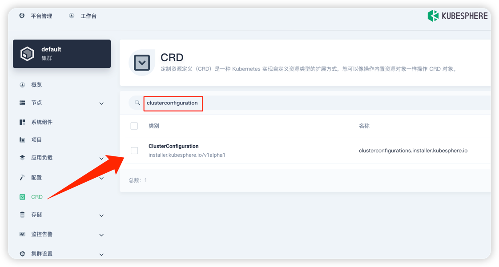
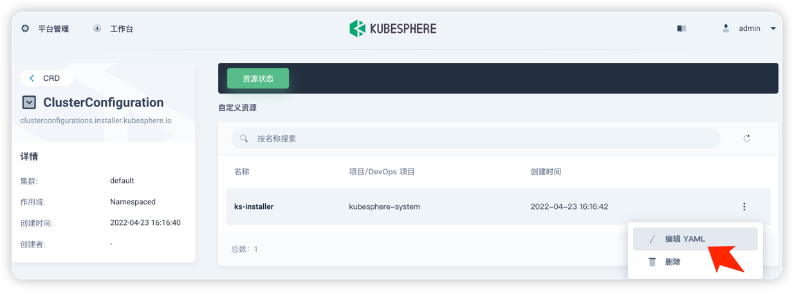
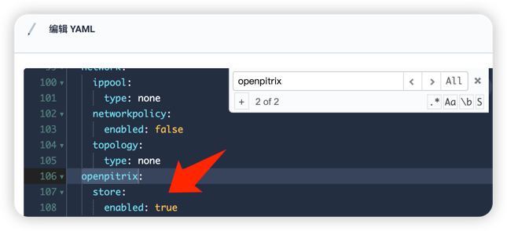
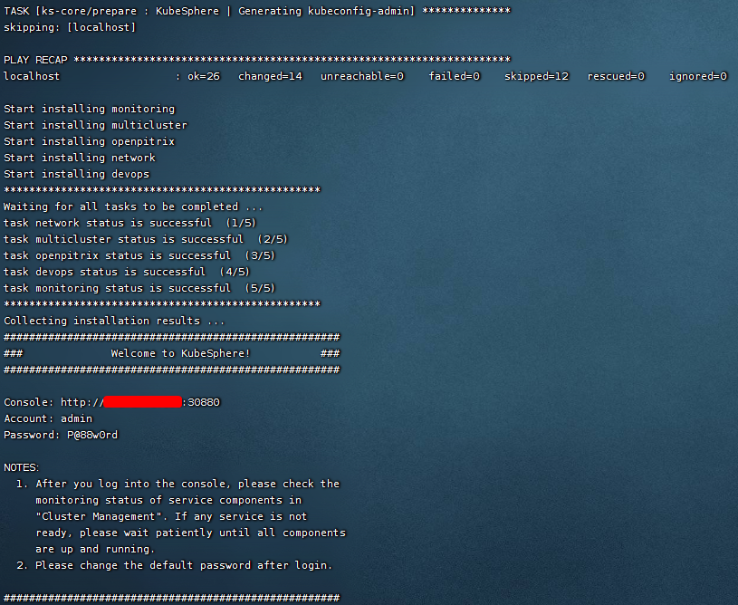
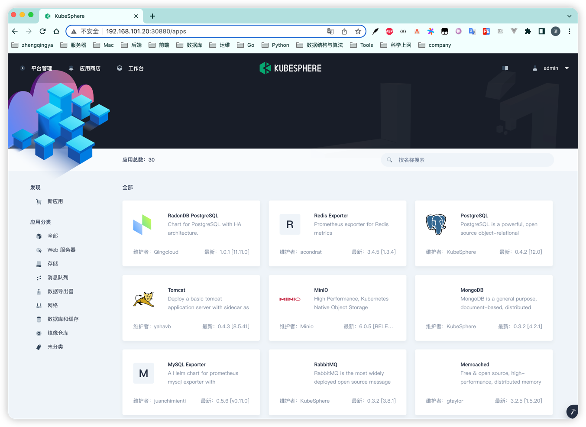
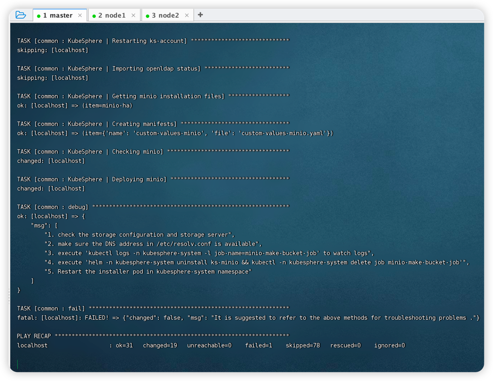

# 应用商店

> https://kubesphere.io/zh/docs/v3.3/pluggable-components/app-store

### 启用`应用商店`

#### 方式一：安装前启用`应用商店` - 在 Kubernetes 上安装

```shell
wget https://github.com/kubesphere/ks-installer/releases/download/v3.3.1/cluster-configuration.yaml

# 替换文本 -> 启用
sed -i "s/enabled: false # Enable or disable the KubeSphere App Store./enabled: true # Enable or disable the KubeSphere App Store./" cluster-configuration.yaml

kubectl apply -f https://github.com/kubesphere/ks-installer/releases/download/v3.3.1/kubesphere-installer.yaml
   
kubectl apply -f cluster-configuration.yaml
```

#### 方式二：安装后启用`应用商店`

`平台管理` -> `集群管理` -> `CRD` -> `clusterconfiguration` -> `ks-installer` -> `编辑YAML`



在该 YAML 文件中，搜索 `openpitrix`，将 `enabled` 的 `false` 改为 `true`。 完成后，点击右下角的确定，保存配置。


> tips: 您可以通过点击控制台右下角 找到 `kubectl` 工具。

#### 检查安装

```shell
kubectl logs -n kubesphere-system $(kubectl get pod -n kubesphere-system -l 'app in (ks-install, ks-installer)' -o jsonpath='{.items[0].metadata.name}') -f
```

云机器操作正常



安装后打开应用商店如下



---

本地虚拟机报错如下：



```shell
TASK [common : KubeSphere | Getting minio installation files] ******************
ok: [localhost] => (item=minio-ha)

TASK [common : KubeSphere | Creating manifests] ********************************
ok: [localhost] => (item={'name': 'custom-values-minio', 'file': 'custom-values-minio.yaml'})

TASK [common : KubeSphere | Checking minio] ************************************
changed: [localhost]

TASK [common : KubeSphere | Deploying minio] ***********************************
changed: [localhost]

TASK [common : debug] **********************************************************
ok: [localhost] => {
    "msg": [
        "1. check the storage configuration and storage server",
        "2. make sure the DNS address in /etc/resolv.conf is available",
        "3. execute 'kubectl logs -n kubesphere-system -l job-name=minio-make-bucket-job' to watch logs",
        "4. execute 'helm -n kubesphere-system uninstall ks-minio && kubectl -n kubesphere-system delete job minio-make-bucket-job'",
        "5. Restart the installer pod in kubesphere-system namespace"
    ]
}

TASK [common : fail] ***********************************************************
fatal: [localhost]: FAILED! => {"changed": false, "msg": "It is suggested to refer to the above methods for troubleshooting problems ."}

PLAY RECAP *********************************************************************
localhost                  : ok=31   changed=19   unreachable=0    failed=1    skipped=78   rescued=0    ignored=0   
```

解决报错

> tips: 这个暂无效，保留...

```shell
# minio这个问题是网络或者储存出来问题, 可以在部署之前设置下kubernetes的仓库
cat <<EOF > /etc/yum.repos.d/kubernetes.repo
[kubernetes]
name=Kubernetes
baseurl=http://mirrors.aliyun.com/kubernetes/yum/repos/kubernetes-el7-x86_64
enabled=1
gpgcheck=0
repo_gpgcheck=0
gpgkey=http://mirrors.aliyun.com/kubernetes/yum/doc/yum-key.gpg
       http://mirrors.aliyun.com/kubernetes/yum/doc/rpm-package-key.gpg
EOF

# 将软件包信息提前在本地索引缓存，用来提高搜索安装软件的速度,建议执行这个命令可以提升yum安装的速度。
yum makecache fast
```

这里重装KubeSphere吧... （通过全功能安装方式）

- 见 [多节点安装KubeSphere(config-sample.yaml)](../01-安装/03-多节点安装KubeSphere.md)
