# 应用仓库

> KubeSphere应用商店中自带的应用很少，可以从Helm中获取更多的应用。

### 1、配置应用仓库 - `bitnami`

#### Helm

- https://helm.sh
- https://artifacthub.io

#### KubeSphere中添加`bitnami`仓库

https://charts.bitnami.com/bitnami

`工作台` -> `选择一个企业空间 ex:my-workspace`  -> `应用管理` -> `应用仓库` -> `添加`

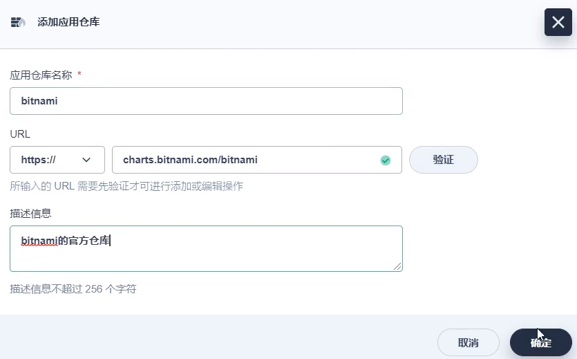

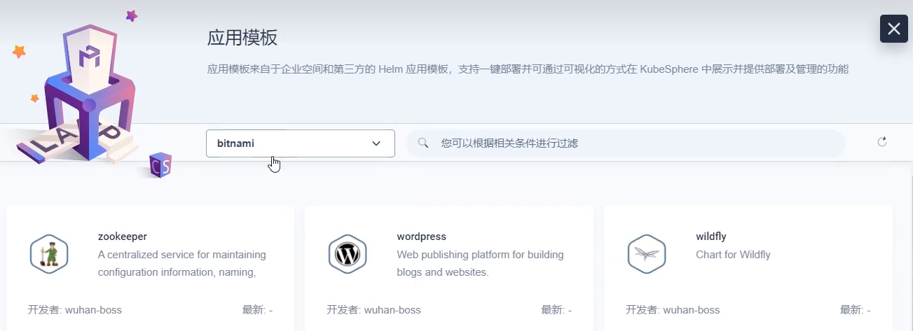

### 2、KubeSphere部署`bitnami`中的应用 - ex: 部署`rabbitmq`

`应用负载` -> `应用` -> `基于模板的应用` -> `创建` -> `从应用模板` -> `选择 bitnami`

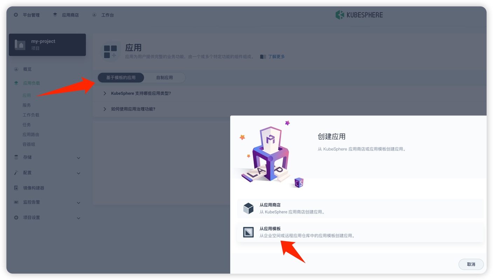

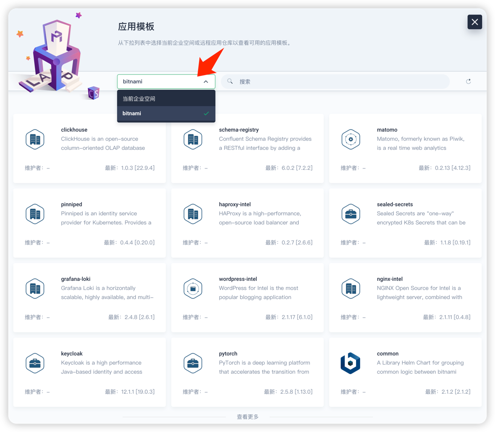

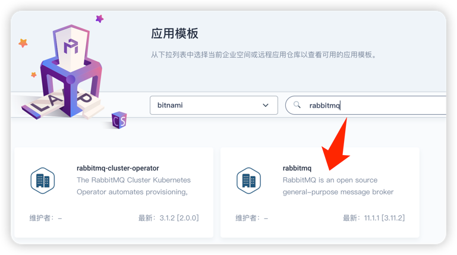

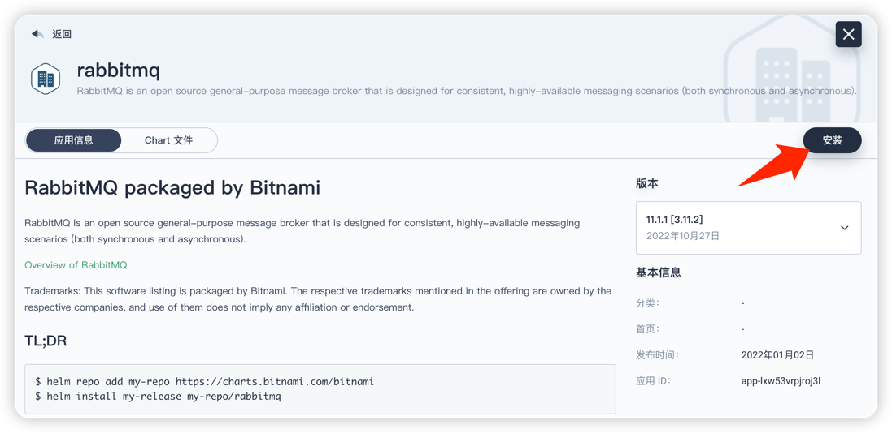

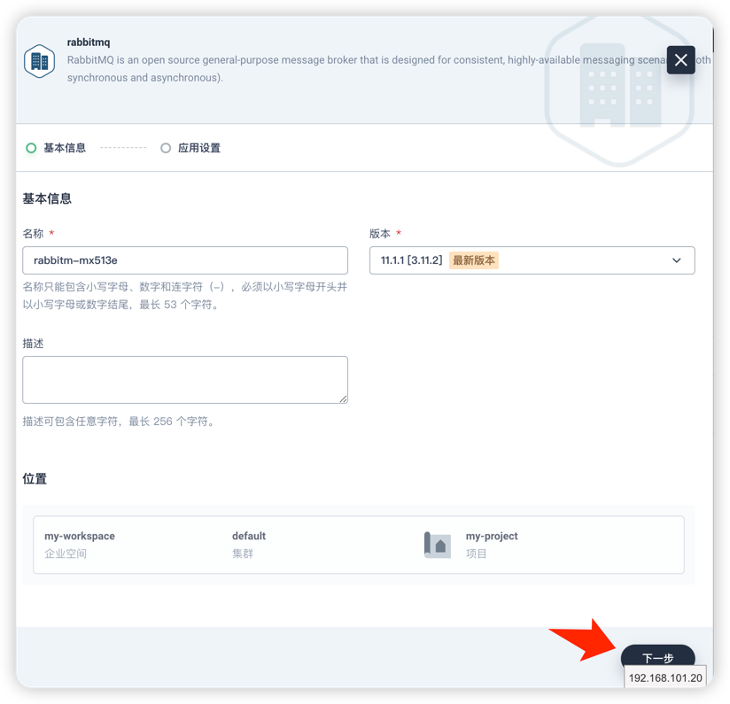

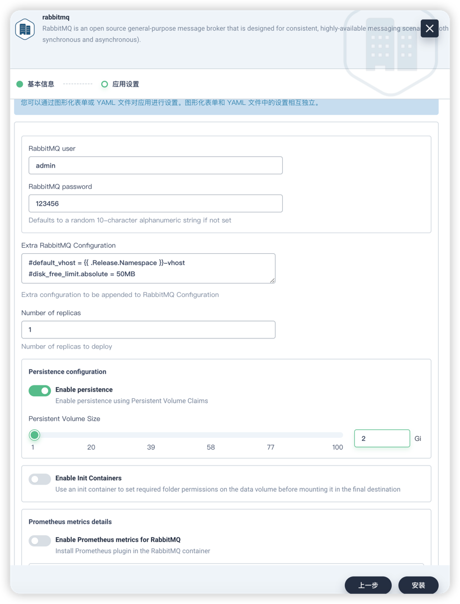

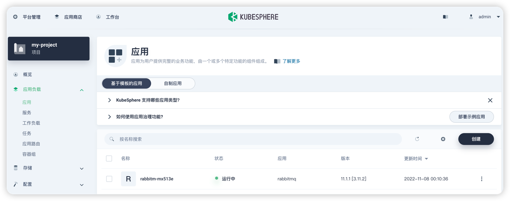

`服务` -> `编辑外部访问`

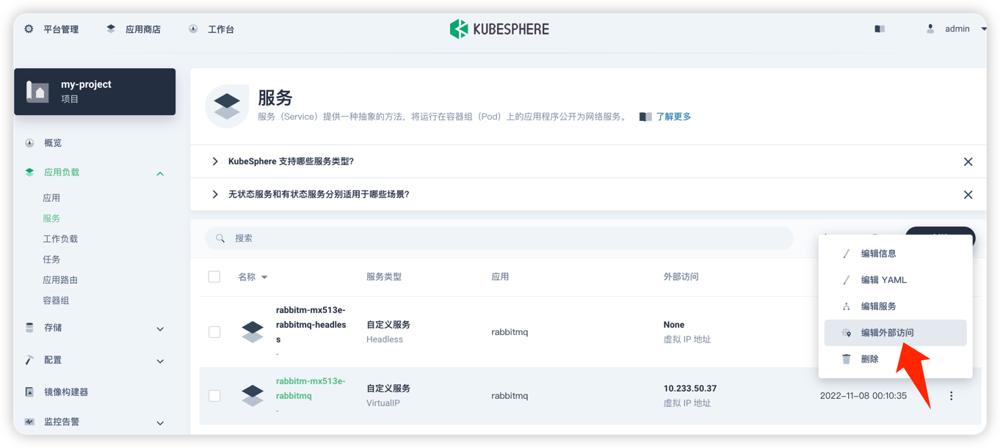

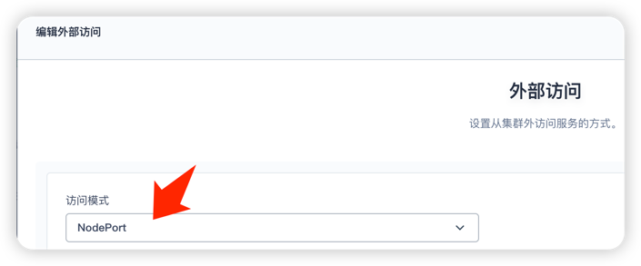

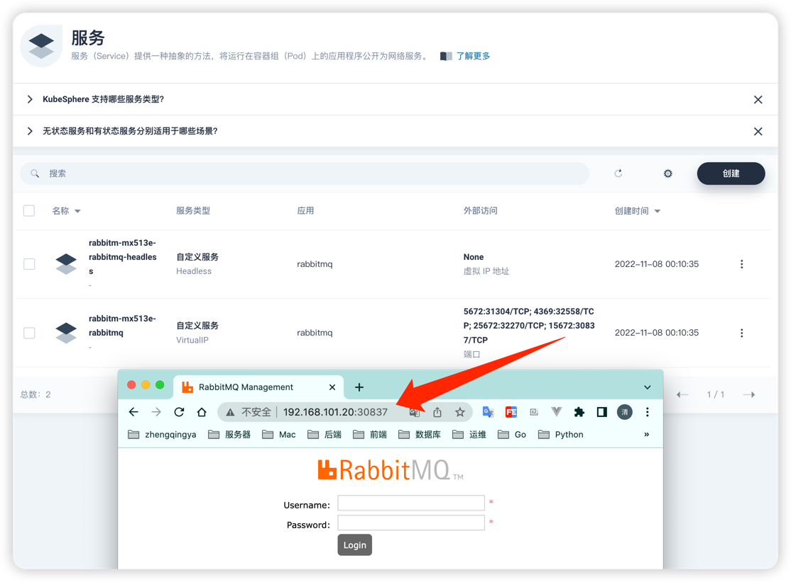

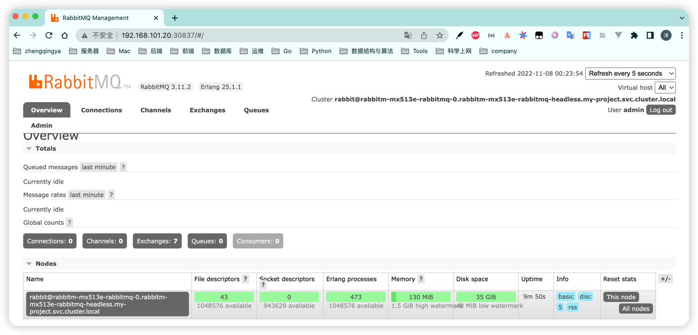
