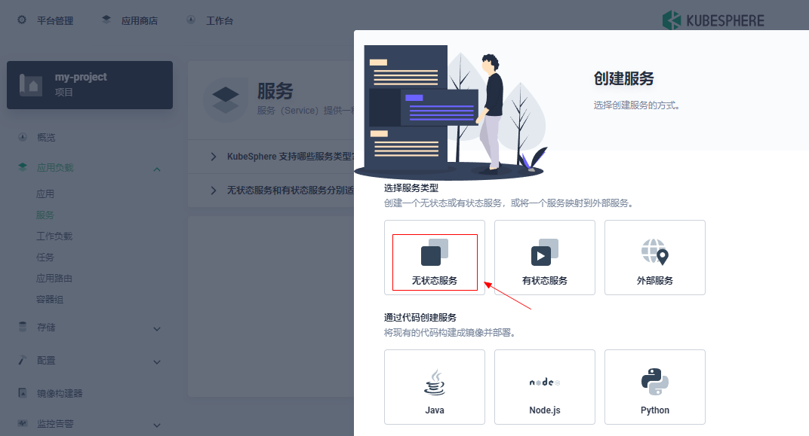
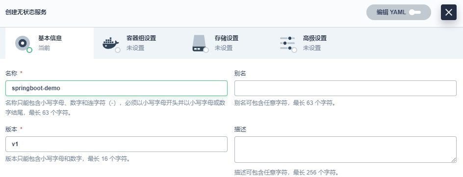
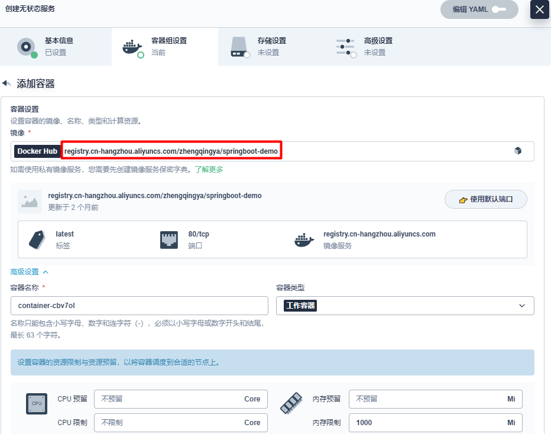
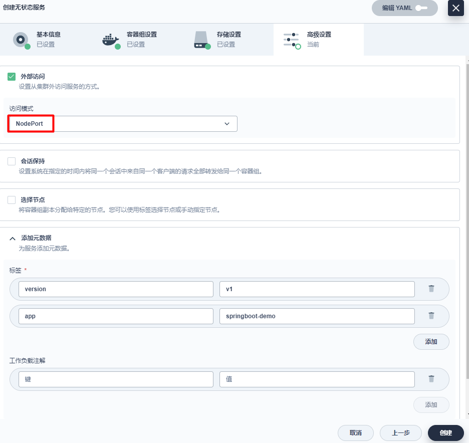
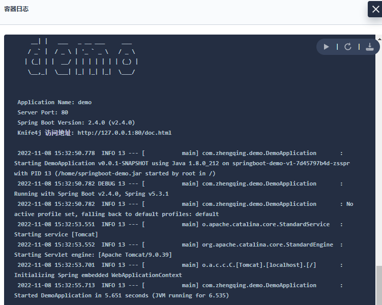
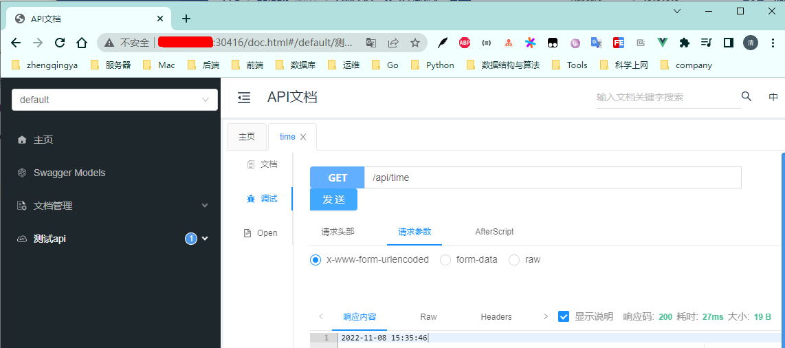
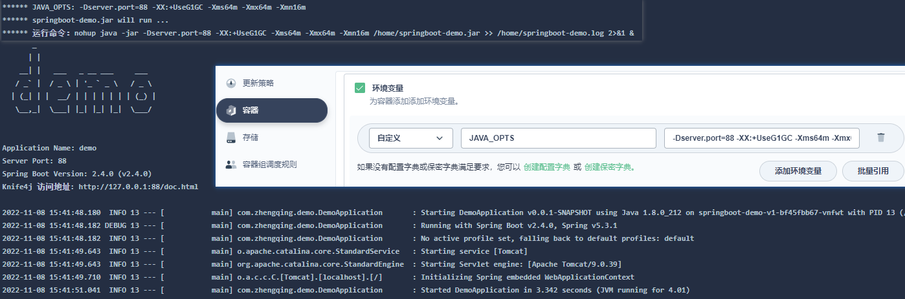

# 部署SpringBoot

`应用负载` -> `服务` -> `创建` -> `选择服务类型` -> `无状态服务`

###### 基本信息

###### 容器组设置

勾选下`同步主机时区`

###### 存储设置

无

###### 高级设置

访问模式选择`NodePort` -> 外部可访问

部署完成

查看日志 或 访问测试：

---

我们也可以去配置下容器的环境变量，指定jar的运行参数

> tips: `JAVA_OPTS`是我在制作Dockerfile时自定义的参数...

