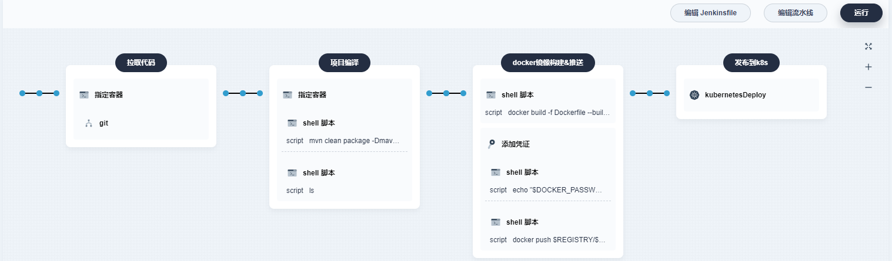

# DevOps

自动检出 (Checkout) 代码、测试、分析、构建、部署并发布


### 一、条件准备

#### 1、gitee仓库认证`gitee-auth`


#### 2、阿里云docker仓库认证`aliyun-docker-registry-auth`


#### 3、k8s凭证`kubeconfig-auth`

```shell
# k8s权限配置文件
cat /root/.kube/config
```


---


#### 4、maven配置阿里云中央仓库


编辑设置


```
<mirrors>
    <!-- 国内中央仓库的配置-阿里云中央仓库 -->
    <mirror>
        <id>nexus-aliyun</id>
        <mirrorOf>central</mirrorOf>
        <name>Nexus aliyun</name>
        <url>http://maven.aliyun.com/nexus/content/groups/public</url>
    </mirror>
</mirrors>
```


### 二、DevOps

#### 1、创建`DevOps项目`


#### 2、创建流水线


进入后可以点击`编辑流水线`，提供了一些模块


ex: 第一步拉取代码


这里自己点着玩吧，很简单... 根据自己的需求去定制即可...

可参考：[Jenkinsfile](Jenkinsfile)



#### 3、`k8s-deploy.yml`

见[k8s-deploy.yml](k8s-deploy.yml)


