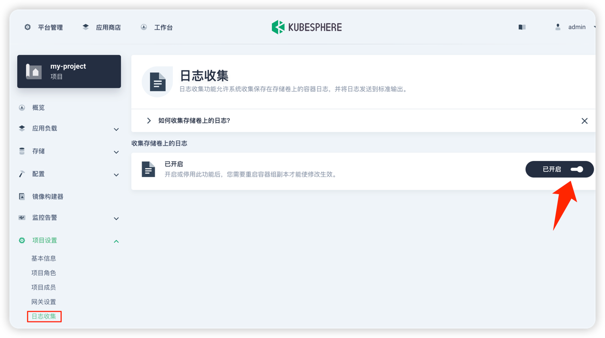
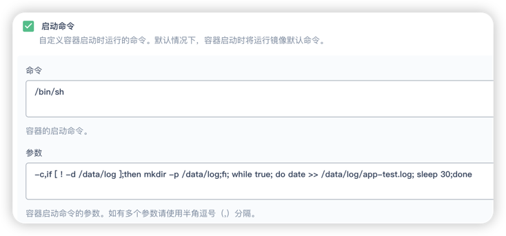
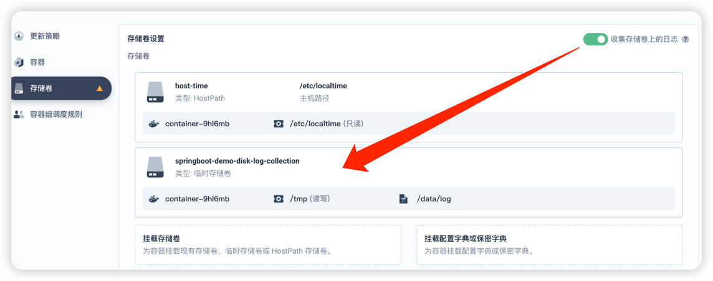

# 日志

> 可参考 https://v3-2.docs.kubesphere.io/zh/docs/project-administration/disk-log-collection

### 1、启用日志插件

`平台管理` -> `集群管理` -> `CRD` -> `clusterconfiguration` -> `ks-installer` -> `编辑YAML`

```yaml
events:
  enabled: true
logging:
  enabled: true
```

检查安装

```shell
kubectl logs -n kubesphere-system $(kubectl get pod -n kubesphere-system -l 'app in (ks-install, ks-installer)' -o jsonpath='{.items[0].metadata.name}') -f
```

### 2、开启日志收集



### 3、创建容器服务

> registry.cn-hangzhou.aliyuncs.com/zhengqingya/springboot-demo

### 4、工具箱 -> 容器日志查询




