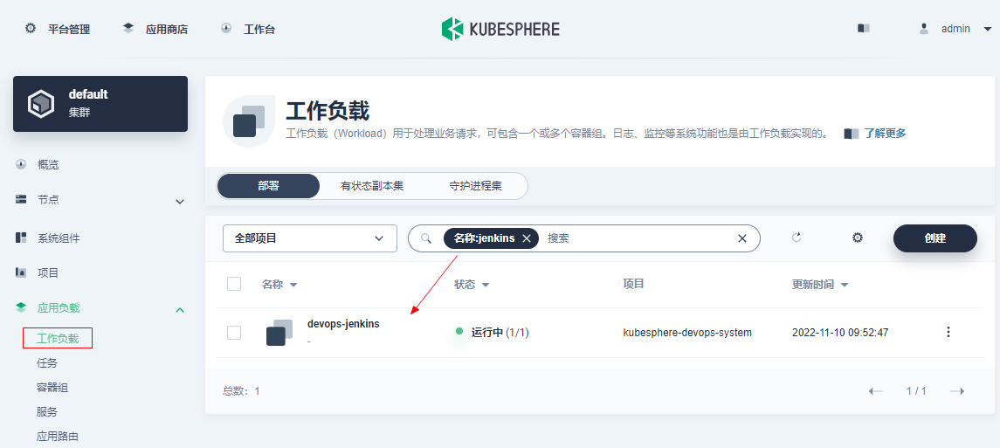
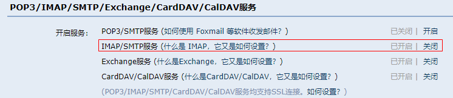
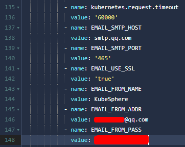
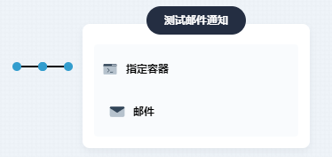

# 邮件通知

> 可参考 https://v3-2.docs.kubesphere.io/zh/docs/devops-user-guide/how-to-use/jenkins-email

### 1、配置邮件服务器

`平台管理` -> `集群管理` -> `应用负载` -> `工作负载` -> `devops-jenkins` -> `编辑YAML`



| 环境变量名称    | 描述信息                  |
| :-------------- | :------------------------ |
| EMAIL_SMTP_HOST | SMTP 服务器地址           |
| EMAIL_SMTP_PORT | SMTP 服务器端口（如：25） |
| EMAIL_FROM_ADDR | 电子邮件发件人地址        |
| EMAIL_FROM_NAME | 电子邮件发件人姓名        |
| EMAIL_FROM_PASS | 电子邮件发件人密码        |
| EMAIL_USE_SSL   | 是否启用 SSL 配置         |





修改之后等待jenkins重启完成...

### 2、测试

Jenkinsfile

```shell
pipeline {
    agent {
        node {
            label 'maven'
        }
    }
    stages {
        stage('测试邮件通知') {
            agent none
            steps {
                container('base') {
                   mail(to: 'xxx@qq.com,xxx@qq.com', subject: '测试', body: "helloworld ${BUILD_NUMBER}")
                }
            }
        }
    }
}
```


