@[TOC](文章目录)

### 一、前言

[运维(28) CentOS7.6安装KubeOperator](https://zhengqing.blog.csdn.net/article/details/124061737)

本文将基于`CentOS Linux release 7.6.1810 (Core)`通过`KubeOperator`部署`Kubernetes集群`

| 机器           | 说明         |
| -------------- | ------------ |
| 192.168.101.89 | KubeOperator |
| 192.168.101.90 | Kubernetes   |

### 二、KubeOperator配置

> KubeOperator文档 [https://kubeoperator.io/docs](https://kubeoperator.io/docs)

#### 1、系统设置 -- 仓库

> 地址：KubeOperator部署机ip

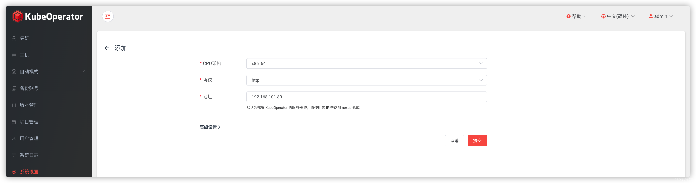

#### 2、系统设置 -- 凭据

> 部署KubeSphere机器登录凭据

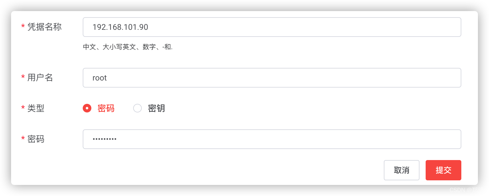

#### 3、项目管理 -- 添加项目

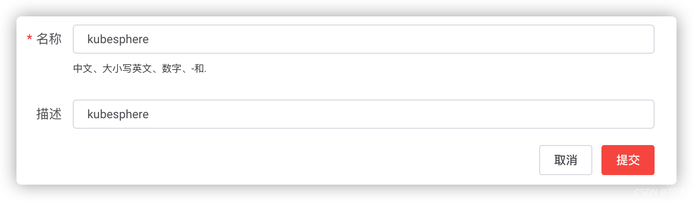

#### 4、主机 -- 添加

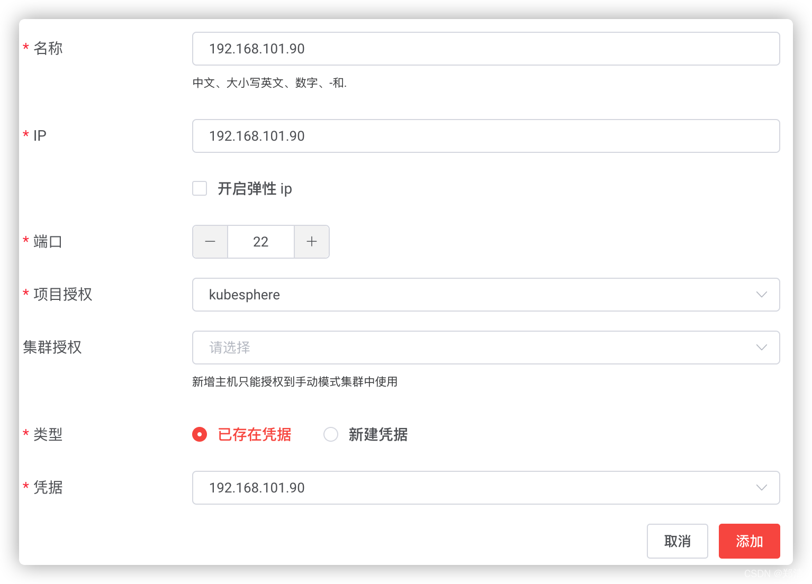

#### 5、集群 -- 添加

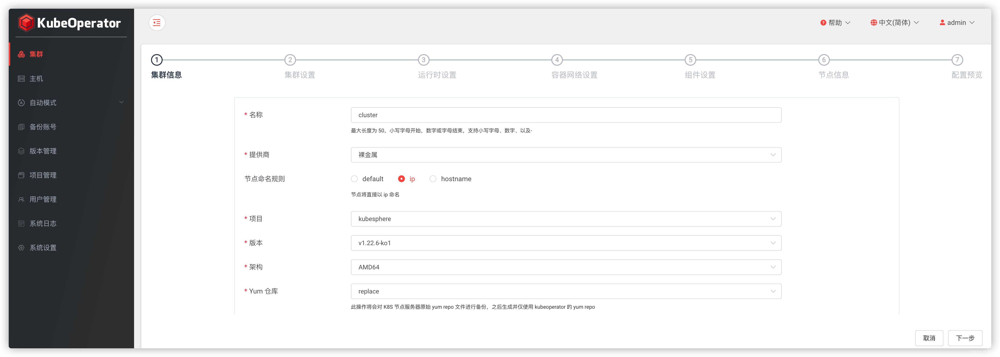
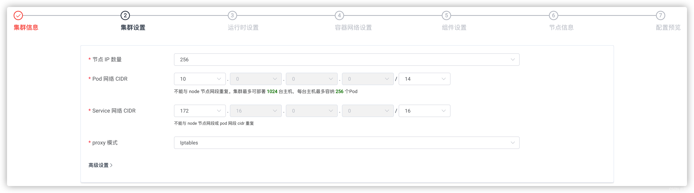
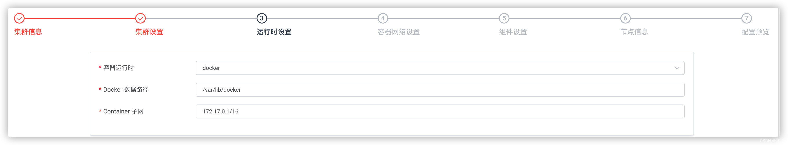
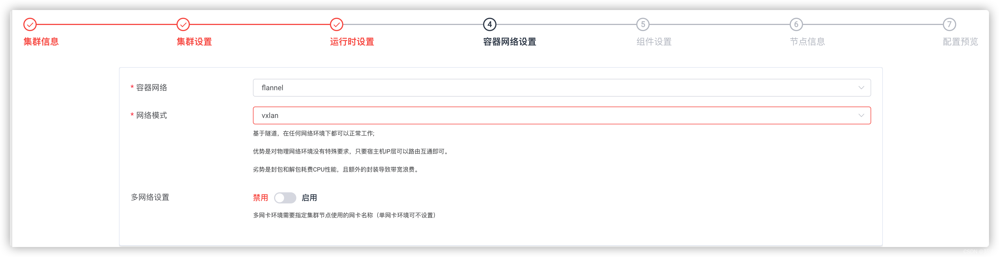
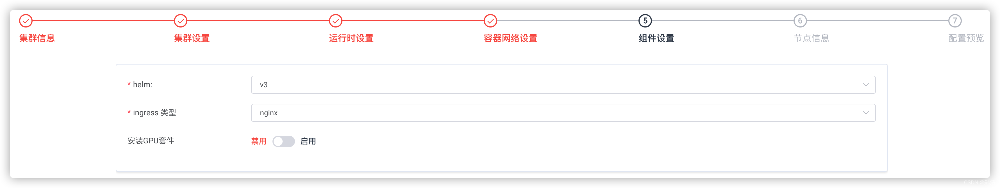
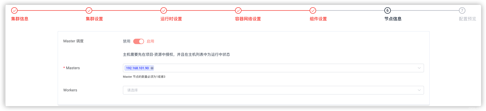
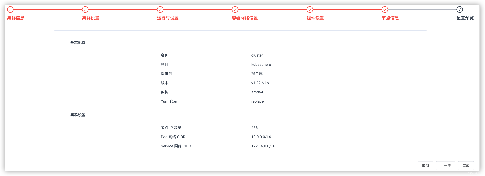
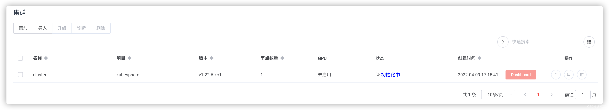
查看日志
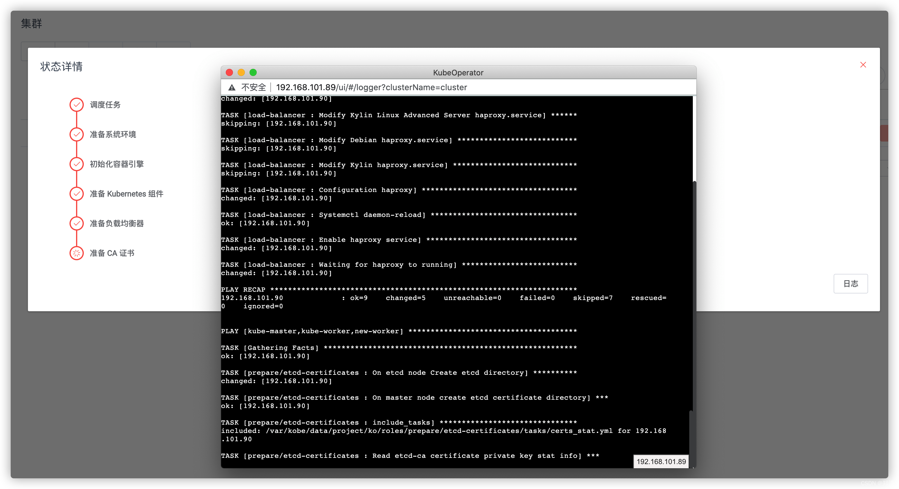
等待集群完成
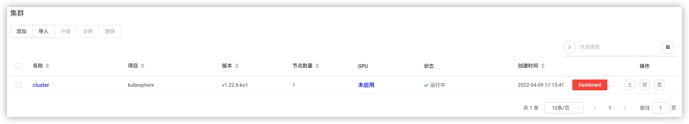
点击`Dashboard`进入`KubePi`

> KubePi 是一款简单易用的开源 Kubernetes 可视化管理面板。

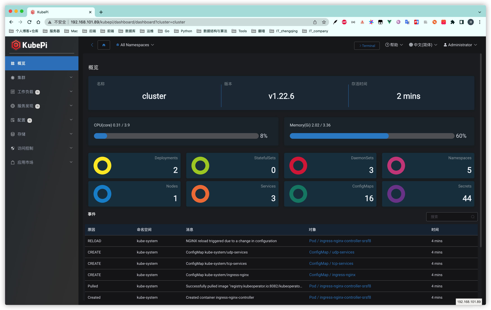
查看集群详情 & 执行`WebKubeCtl`命令行

> WebKubectl 帮助您管理 Kubernetes 集群的凭据，并在 Web 浏览器中运行 kubectl 命令，从而不必在本地 PC 或其他服务器上安装 kubectl。

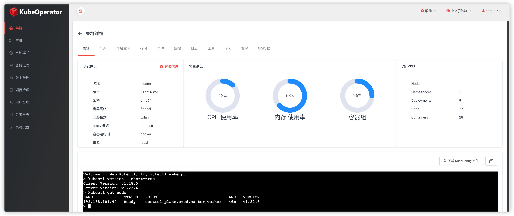

--- 

> 今日分享语句：
> 善于把握生命的每一个瞬间,才能感受人生的每一个精彩。

