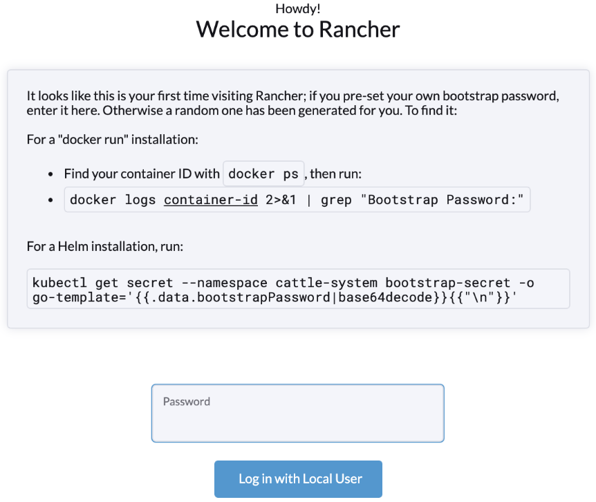
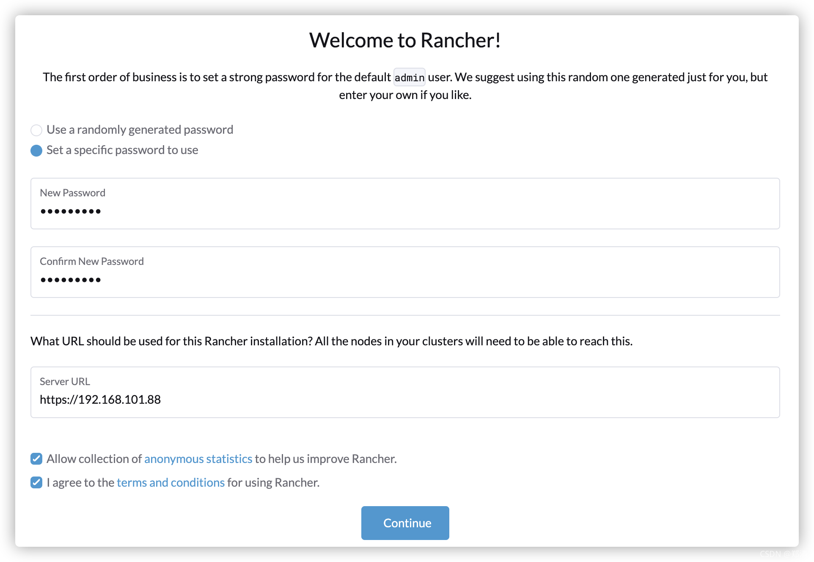
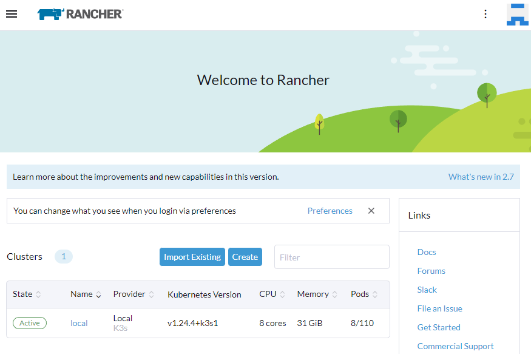

# 安装

见 https://gitee.com/zhengqingya/docker-compose

### Quick Start

```shell
sudo docker run -d --name=rancher --restart=unless-stopped -p 20000:80 -p 20443:443 -p 30000-30050:30000-30050 --privileged rancher/rancher
# 查看密码
docker logs rancher 2>&1 | grep "Bootstrap Password:"
# 2023/01/11 02:07:22 [INFO] Bootstrap Password: wgxxj2vksgfj89xkll2cwtf9b5gfjg9vcjpmwgnc5rzsvggxjl2bc9
```

访问地址：`http://ip地址:20000`



设置新的admin账号密码和服务url（注：需要保证之后的节点能够连接这个地址，即服务器上部署不要填写127.0.0.1这种本地ip地址）


进入Rancher



