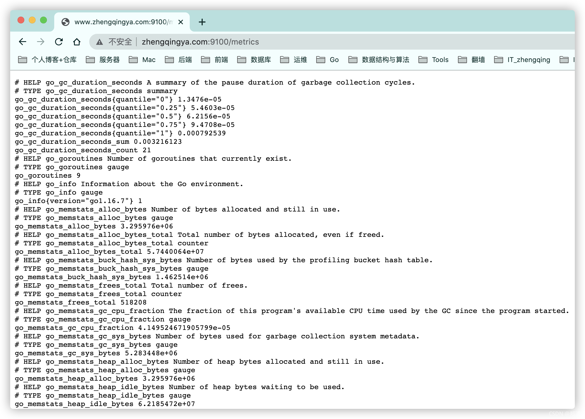
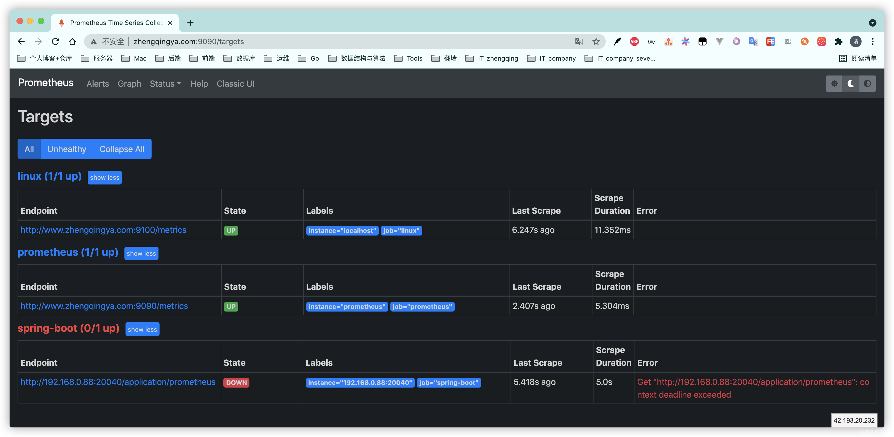
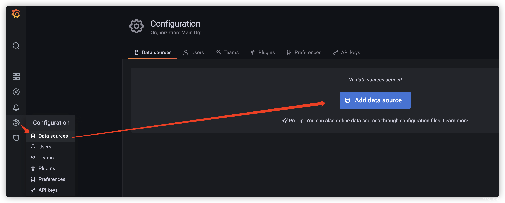
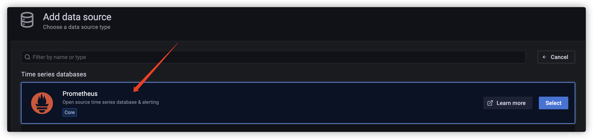
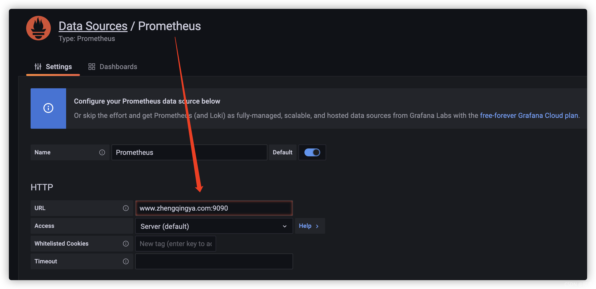
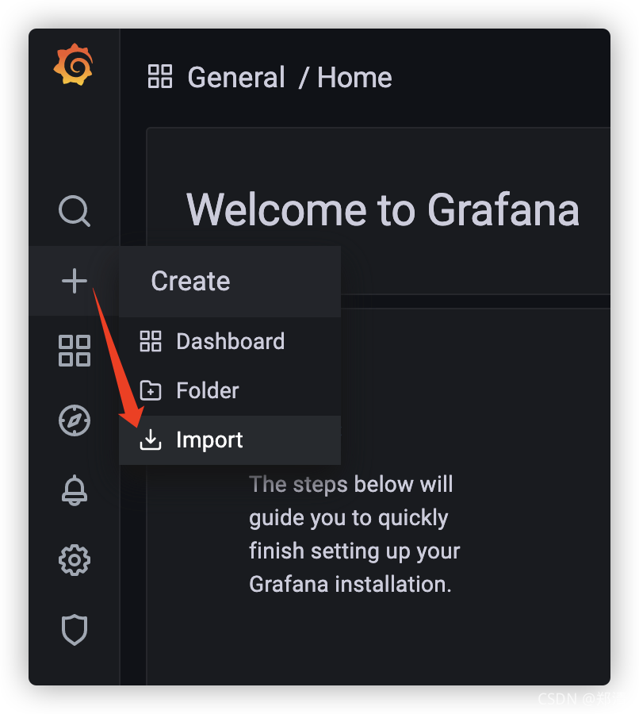
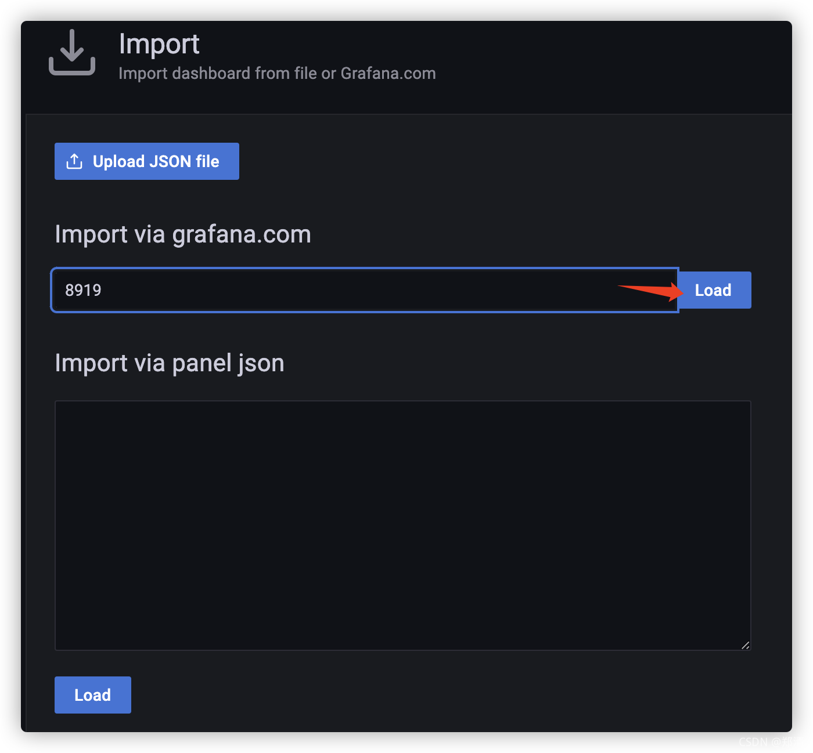
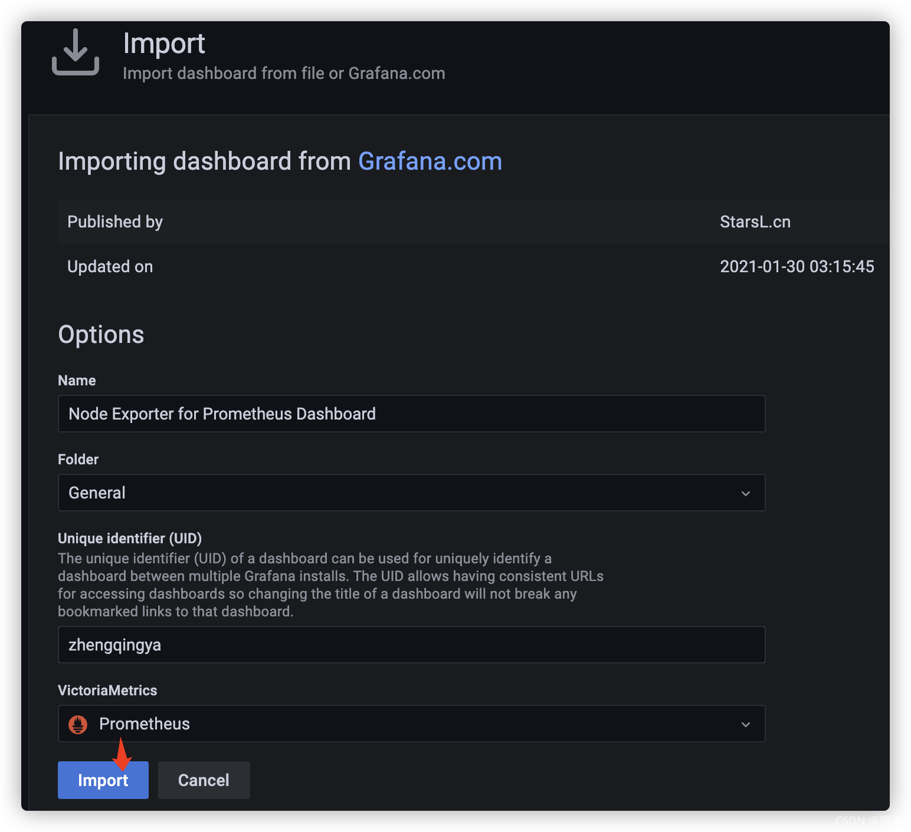
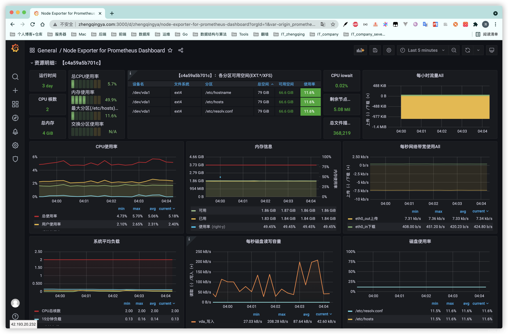

# Grafana+Prometheus搭建Linux监控系统

### 一、docker-compose部署

```
# 环境准备
git clone https://gitee.com/zhengqingya/docker-compose.git
cd docker-compose/Linux
# 注：
# 	1. `docker-compose-prometheus.yml` 需修改grafana中配置的mysql连接信息
# 	2. `prometheus.yml` 自行配置
# 运行
docker-compose -f docker-compose-prometheus.yml -p prometheus up -d
```

### 二、访问

#### 1、exporter

`http://ip地址:9100/metrics`  


#### 2、prometheus

`http://ip地址:9090/targets`

`Status` -> `Targets`  


#### 3、grafana

`http://ip地址:3000`  
默认登录账号密码：`admin/admin`  


### 三、Grafana配置

#### 1、新增Prometheus数据源

`Configuration` -> `Data sources` -> `Add data source` -> `Prometheus`  
  
  
配置prometheus地址  
  
保存并测试连接  


#### 2、导入Prometheus Dashboard

`Create` -> `Import`  
  
输入`8919`

> 温馨小提示：资源可从 [https://grafana.com/grafana/dashboards](https://grafana.com/grafana/dashboards) 中选择

  
  
查看Linux监控信息如下  


---

> 今日分享语句：  
> 不论你在什么时候开始，重要的是开始之后就不要停止。

