# 制作U盘启动盘安装CentOS7

### 一、前言

本文将基于windows系统制作U盘启动盘来安装centos7系统  
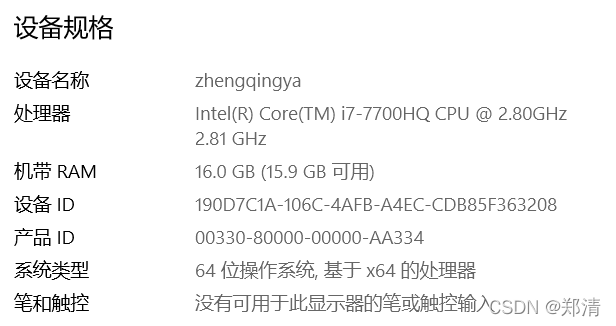

### 二、制作U盘启动盘

#### 1、下载CentOS的iso镜像

> [https://www.centos.org/download](https://www.centos.org/download)

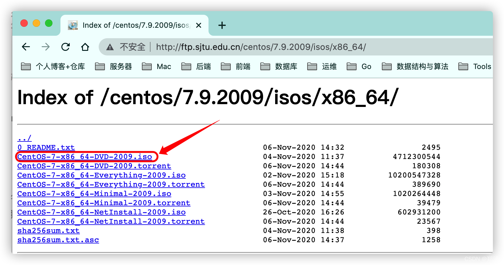  
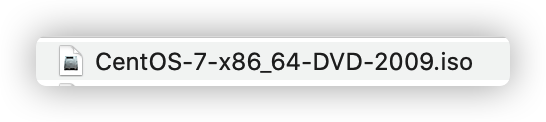

#### 2、使用Rufus创建USB启动盘 – 法一

> 下载Rufus [http://rufus.ie/zh](http://rufus.ie/zh)  
> tips: 建议使用法一，法二可能会出现问题

双击运行即可  
  
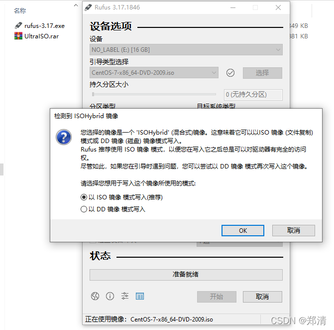  
成功后查看U盘内容如下  
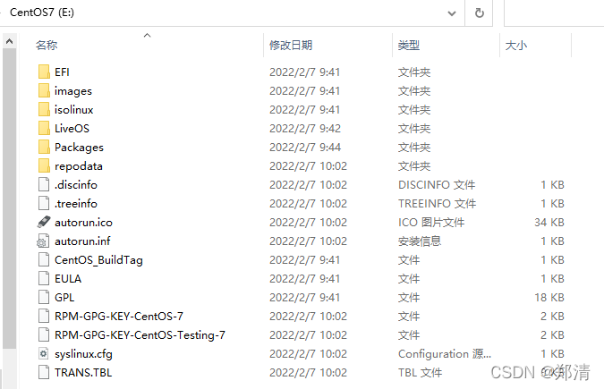

#### 3、使用UltraISO创建USB启动盘 – 法二

>
下载UltraISO [https://gitee.com/zhengqingya/java-developer-document](https://gitee.com/zhengqingya/java-developer-document)
> 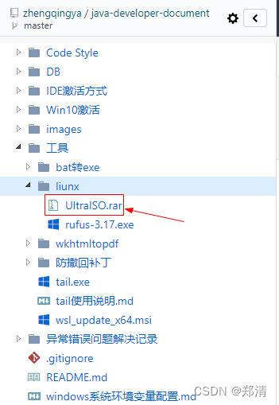

双击安装自己玩吧`^_^`  
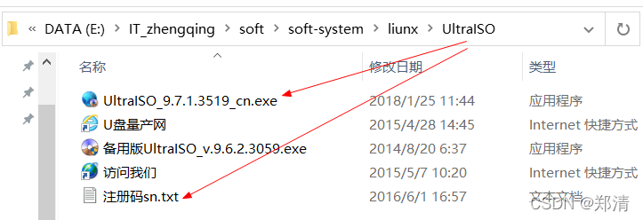

`文件` -> `打开` -> `选择之前下载的 CentOS-7-x86_64-DVD-2009.iso 文件`  
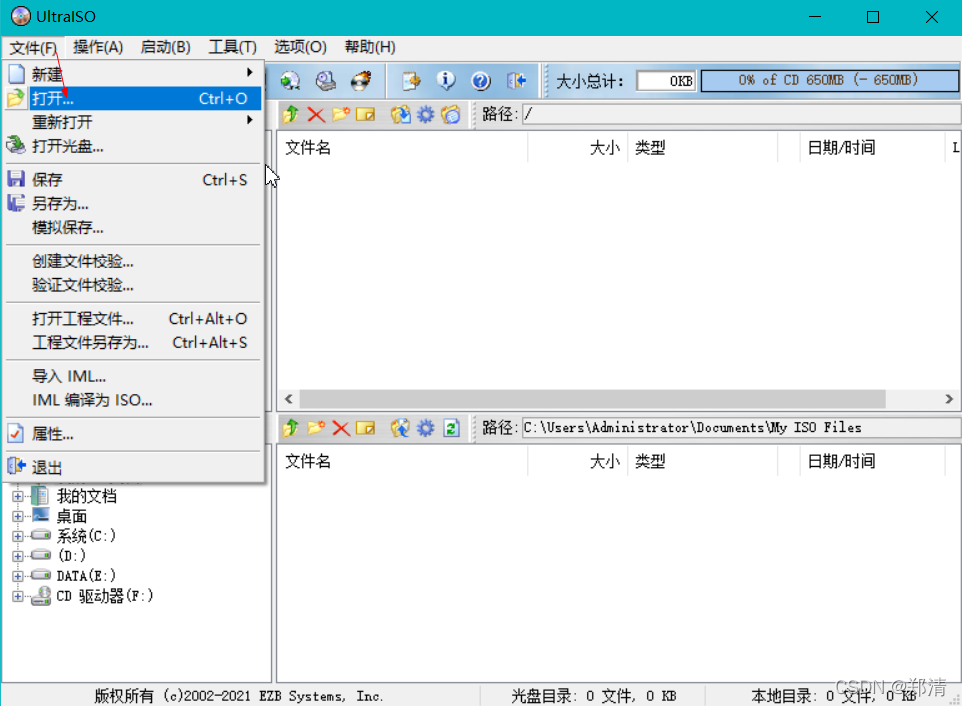  
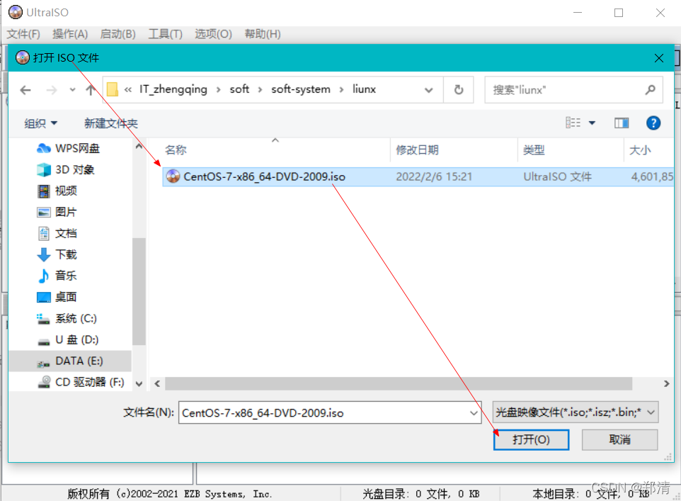  
`启动` -> `写入硬盘映像`  
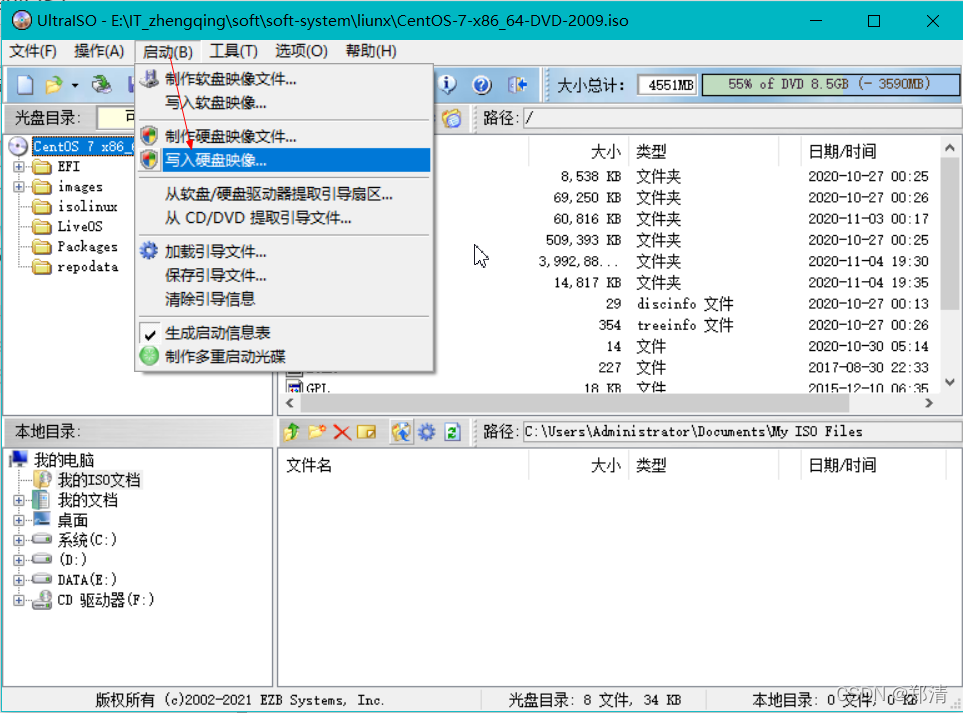

> tips: 记得备份U盘中的数据防止丢失！  
> 

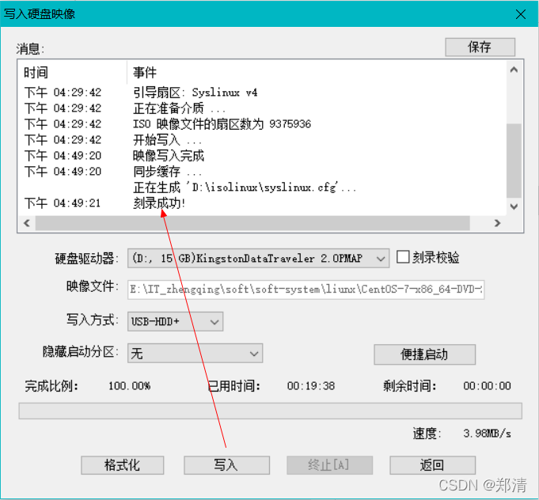

### 三、安装CentOS7系统

#### 1、设置U盘启动

> tips: 不同电脑配置自行百度如何进入`^_^`  
> 这里以`Dell Inspiron 7577`为例

重启电脑，出现商标时按`F2`进入`BIOS`

`Secure Boot` -> `Secure Boot Enable` -> `Disabled` -> `Apply`

  
`Security` -> `PTT security` -> `去掉勾选 PTT On` -> `Apply`  
  
`General` -> `Advanced Boot Options` -> `勾选 Enable Legacy Option ROMs` -> `Apply`  
  
`System Configuration` -> `SATA Operation` -> `勾选AHCI` -> `Apply`  
  
`General` -> `Boot Sequence` -> `Legacy` -> `Apply`  
  
`Exit` -> `重启电脑` -> `出现商标时按F12` -> `LEGACY BOOT` -> `USB Storage Device` -> `回车`  

#### 2、安装CentOS7

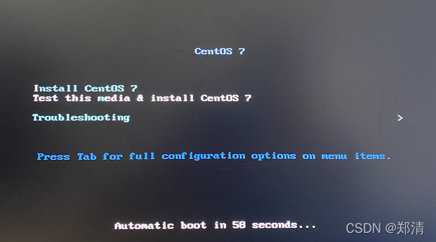  
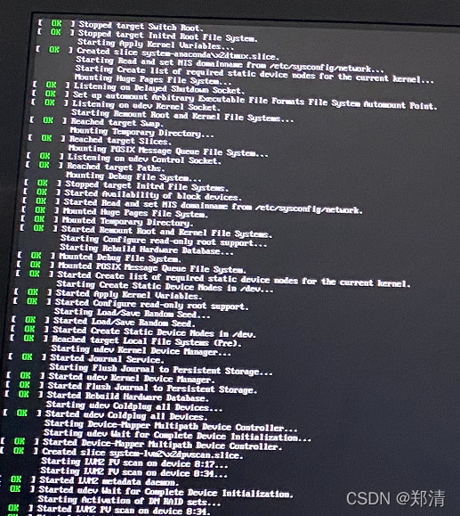  
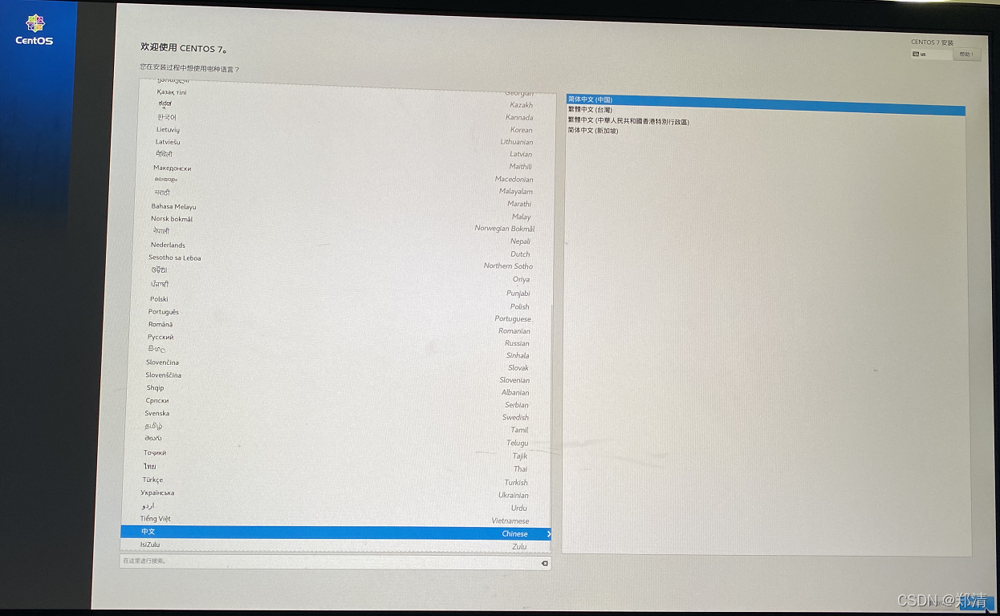  
安装位置配置  
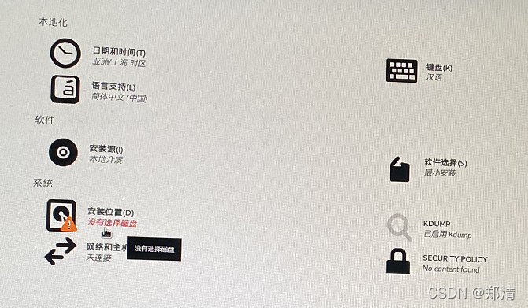  
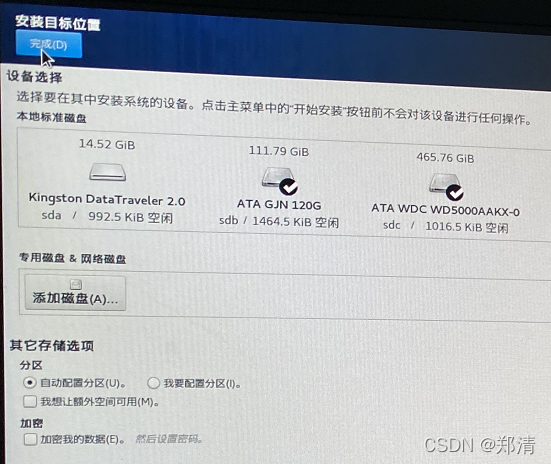  
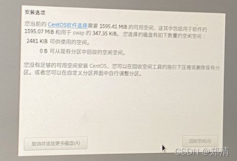  
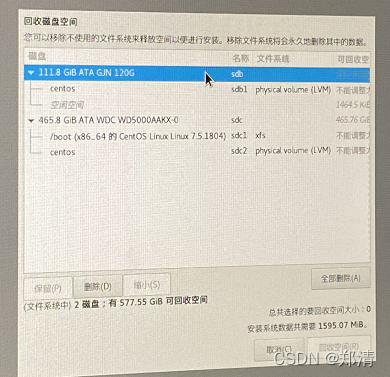  
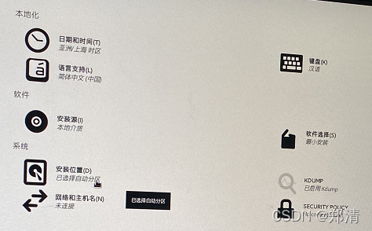  
图形化配置  
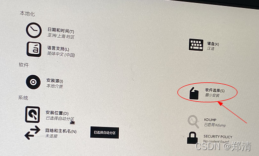  
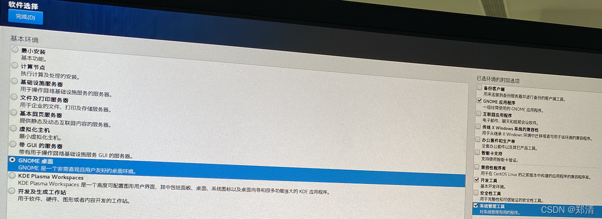  
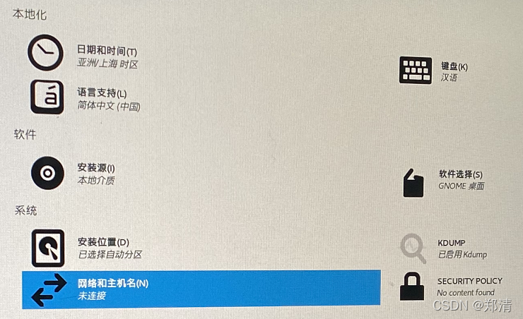  
`开始安装` -> `设置root密码`  
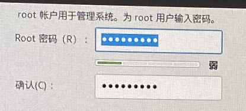  
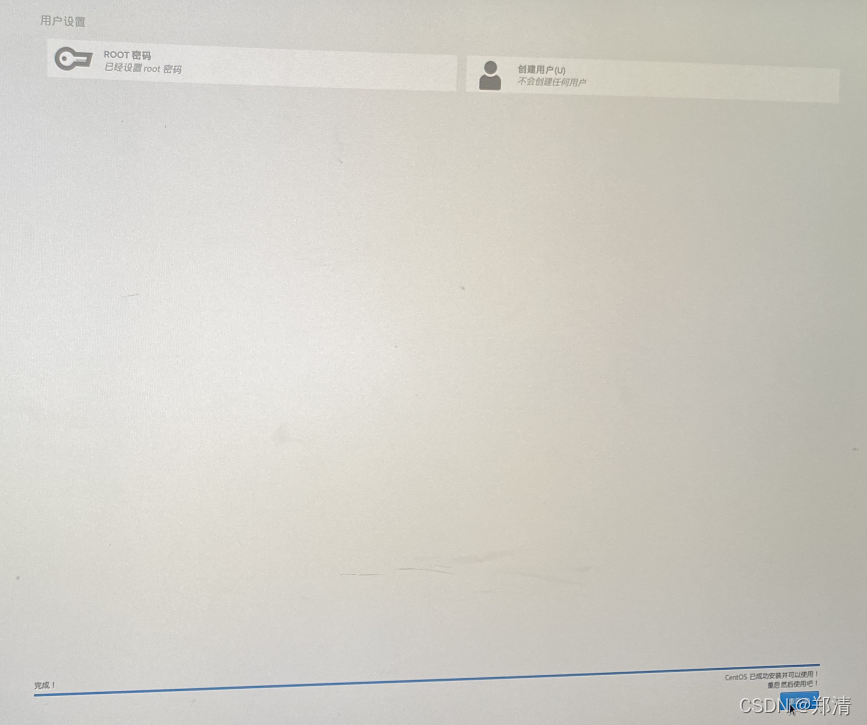  
下面自己配置即可  
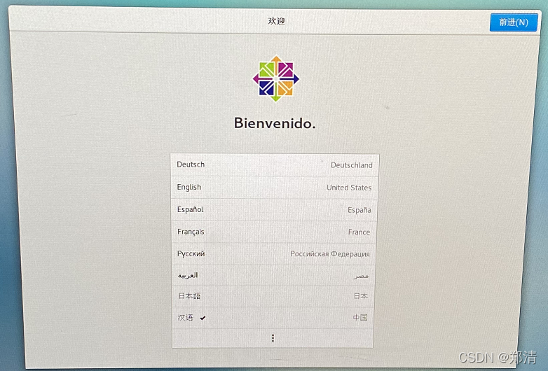  
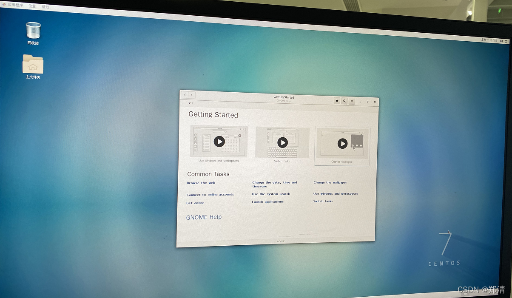

---

> 今日分享语句：  
> 我们最值得自豪的不在于从不跌倒,而在于每次跌倒之后都爬起来。

