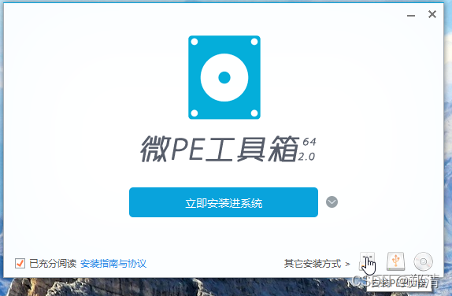
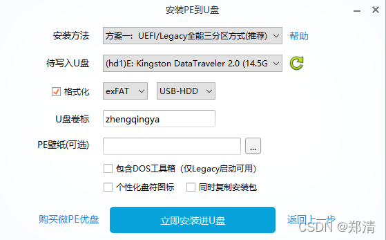
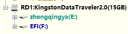
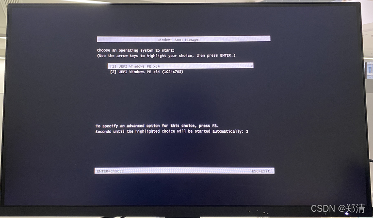
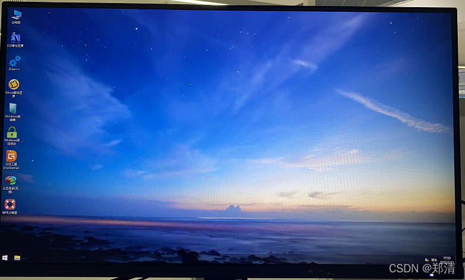
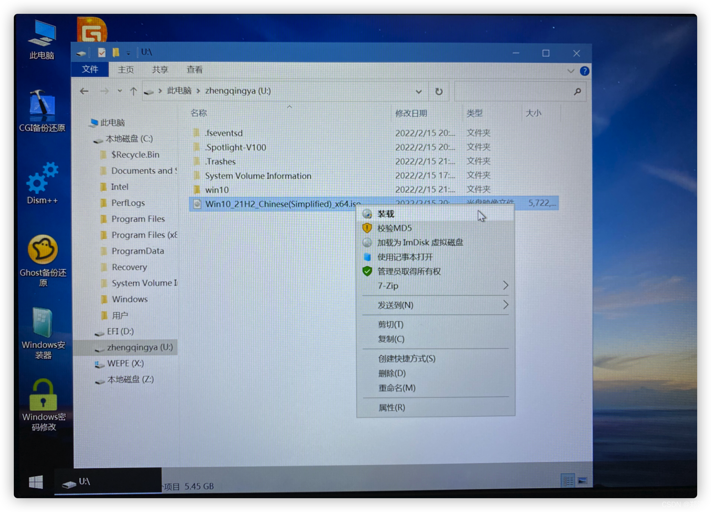
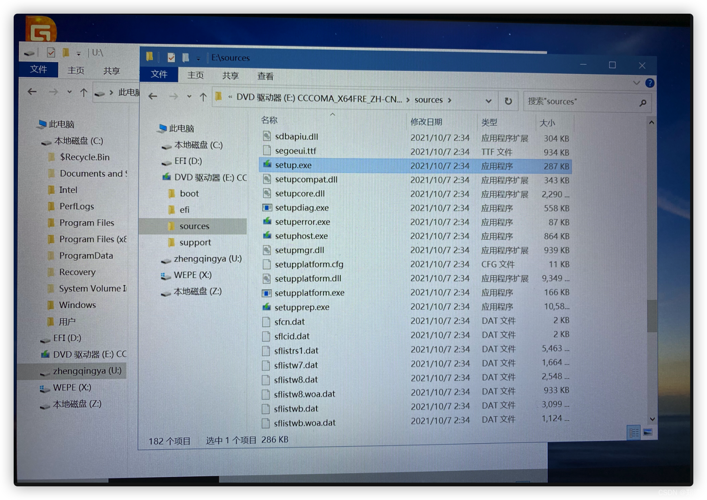
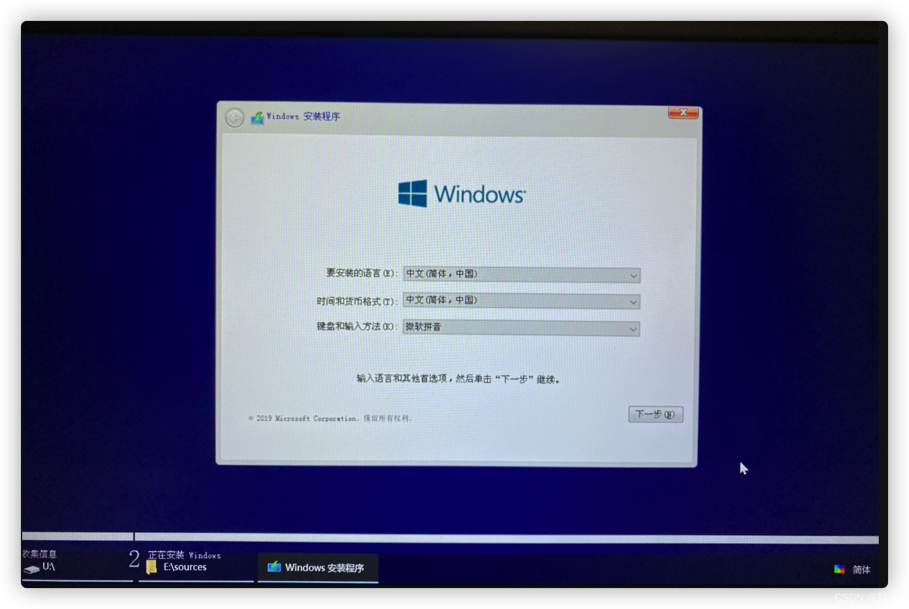
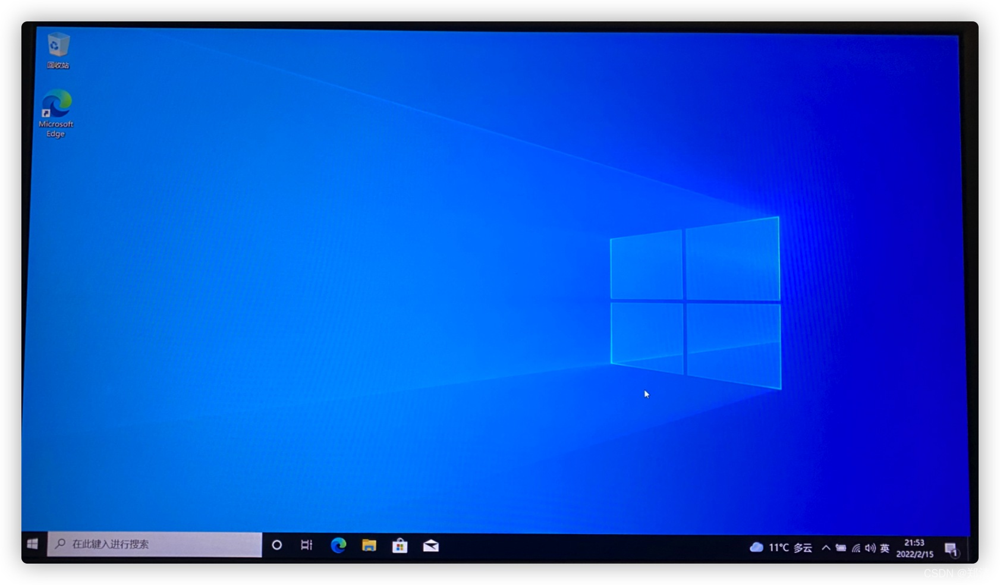
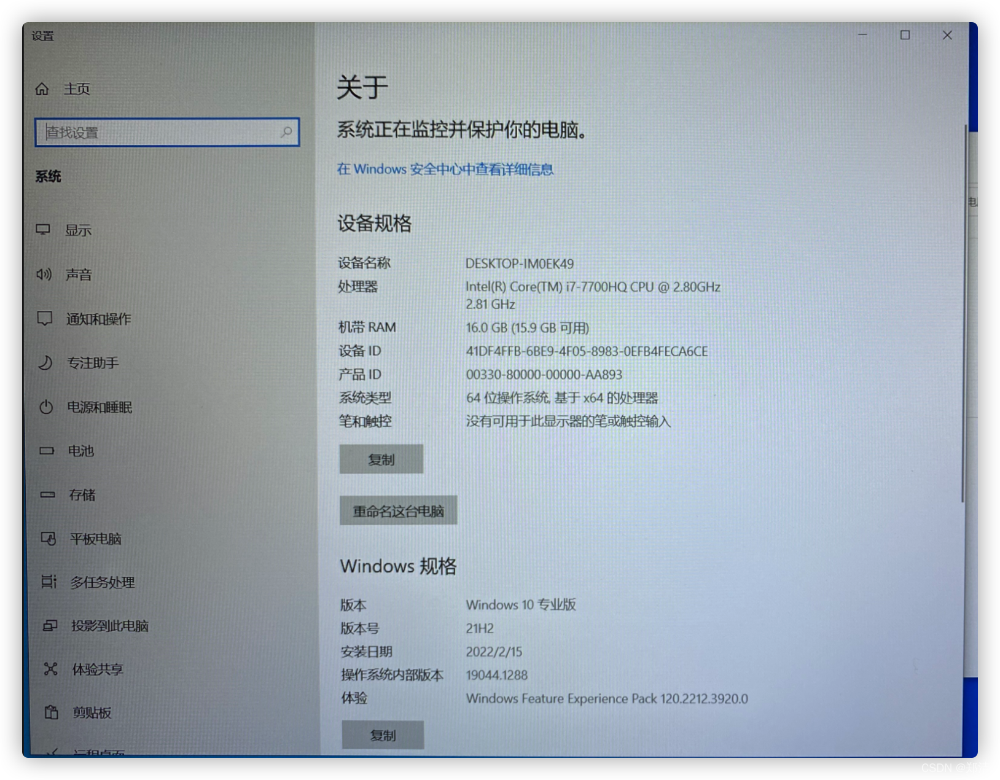

# 制作WinPE启动U盘

### 一、前言

本文将基于`Dell Inspiron 7577`笔记本使用`微PE工具箱`制作`WinPE`启动U盘  

### 二、制作PE启动U盘

> 下载 [https://www.wepe.com.cn/download.html](https://www.wepe.com.cn/download.html)  
> 

  
  
  
完成之后，会多一个`EFI`分区  

### 三、进入PE

> 根据自己的电脑配置将BIOS设置为U盘启动方式

  

### 四、WinPE安装win10系统

#### 1、下载win10镜像

[https://www.microsoft.com/zh-cn/software-download](https://www.microsoft.com/zh-cn/software-download)

#### 2、WinPE中装载ISO镜像

#### 3、`sources` -> `setup.exe` -> `运行安装界面`

  
  
后面就不说了，跟着提示操作即可`^_^`  
  

---

> 今日分享语句：  
> 我不敢休息，因为我没有存款。  
> 我不敢说累，因为我没有成就。  
> 我不敢偷懒，因为我还要生活。  
> 我能放弃选择，但是我不能选择放弃。  
> 坚强拼搏是我唯一的选择。
