# 制作启动U盘安装黑苹果macOS

### 一、前言

1. [运维(19) 制作U盘启动盘安装CentOS7](https://zhengqing.blog.csdn.net/article/details/122798317)
2. [运维(20) 制作启动U盘安装Win10](https://blog.csdn.net/qq_38225558/article/details/122889664)

本文基于 `Dell Inspiron 7577` 笔记本安装黑苹果 `macOS`

### 二、下载系统

> tips: 根据自己的电脑配置找合适的系统下载，只要找的好，就会非常顺利；  
> 小编不断换了很多版本尝试，由于是边操作边记录，因此文章包含图中的版本可能会不一致，本文仅做参考，记录下操作流程。

### 三、制作启动U盘

> tips: 建议使用`balenaEtcher`方式制作启动U盘

#### 1、`TransMac`制作启动U盘 – 法一

`右击U盘` -> `Restore with Disk Image` -> `选择mac系统写入U盘`  
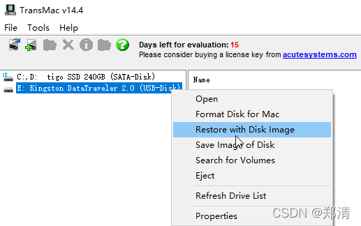  
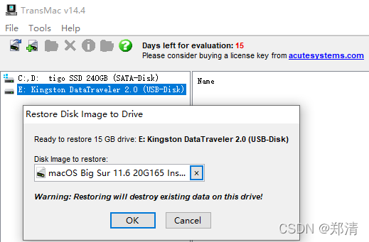  
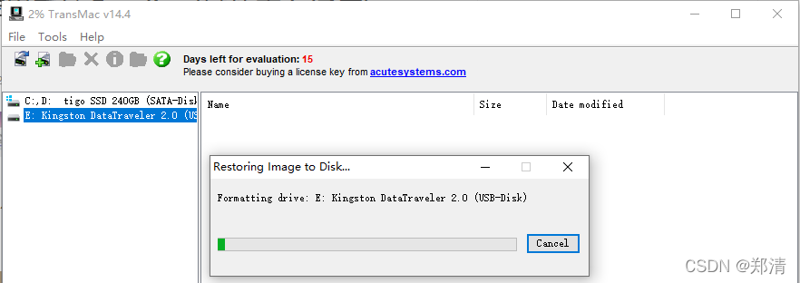

#### 2、`balenaEtcher`制作启动U盘 – 法二

> 下载 [https://www.balena.io/etcher](https://www.balena.io/etcher)

`Flash from file` -> `Select target` -> `Flash`  
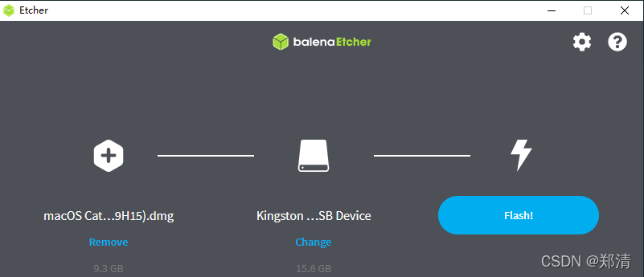  
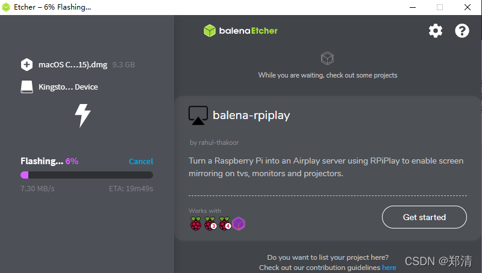  
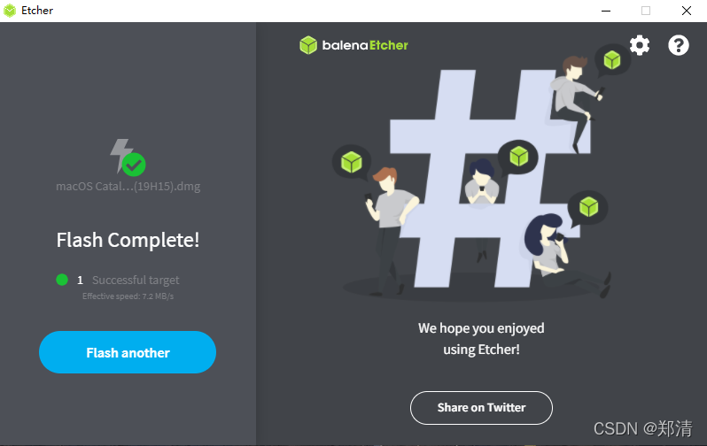

#### 3、下载适合自己机型的EFI

> [https://blog.daliansky.net/Hackintosh-long-term-maintenance-model-checklist.html](https://blog.daliansky.net/Hackintosh-long-term-maintenance-model-checklist.html)  
> `Dell Inspiron 7577 EFI` [https://github.com/lersy/Dell-7577-Hackintosh-macos-Opencore/releases/tag/21121](https://github.com/lersy/Dell-7577-Hackintosh-macos-Opencore/releases/tag/21121)

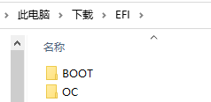  
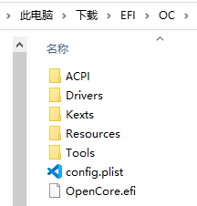

#### 4、替换`EFI`

> 下载分区工具DiskGenius [https://www.diskgenius.cn](https://www.diskgenius.cn/)  
> tips: 万能兼容的镜像系统符合自己电脑配置，则不需要替换

将EFI里的内容替换成之前下载的EFI  
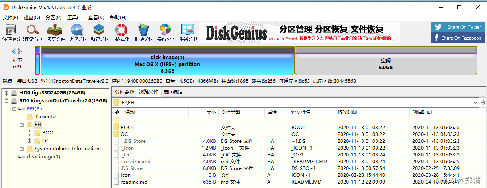

### 四、安装黑苹果

> bios设置u盘启动

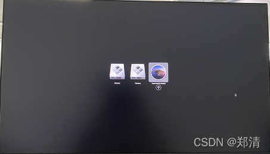  
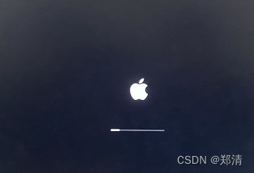

---

> 今日分享语句：  
> 进步和成长的过程总是有许多的困难与坎坷的。有时我们是由于志向不明，没有明确的目的而碌碌无为。但是还有另外一种情况，是由于我们自己的退缩，与自己“亲密”的妥协没有坚持到底的意志，才使得机会逝去，颗粒无收。

