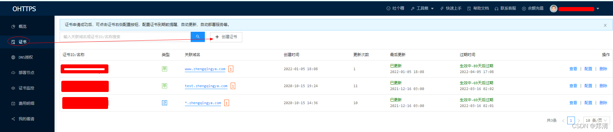
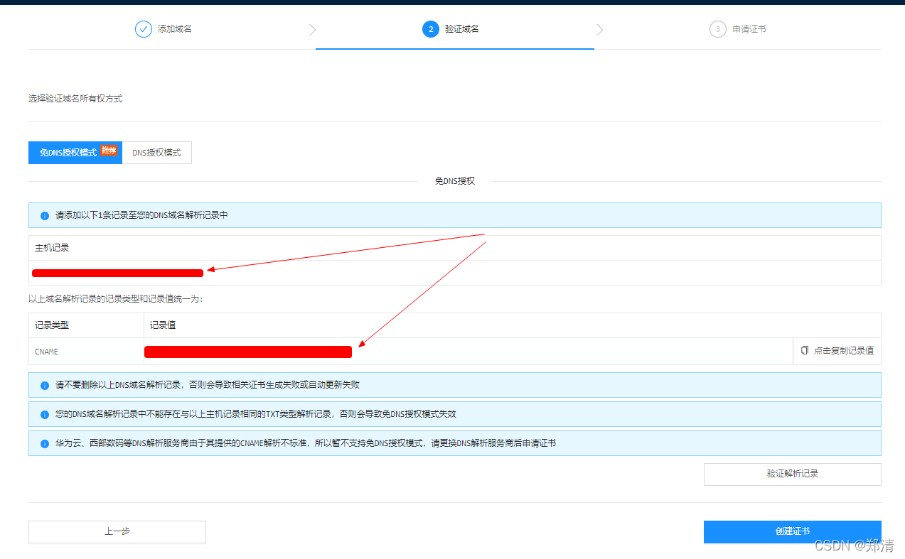
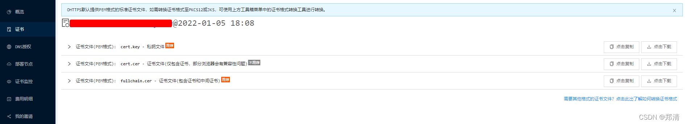
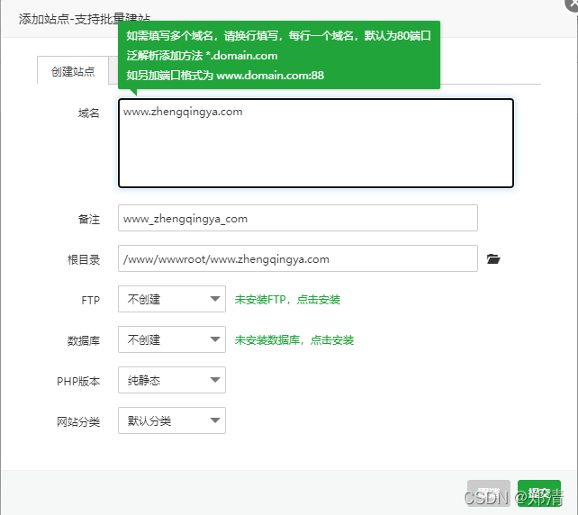
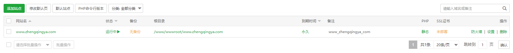
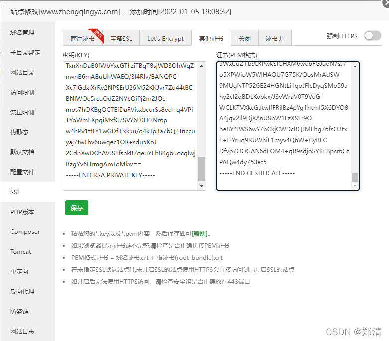
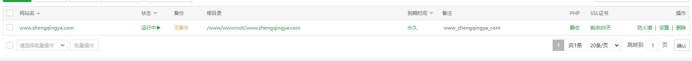
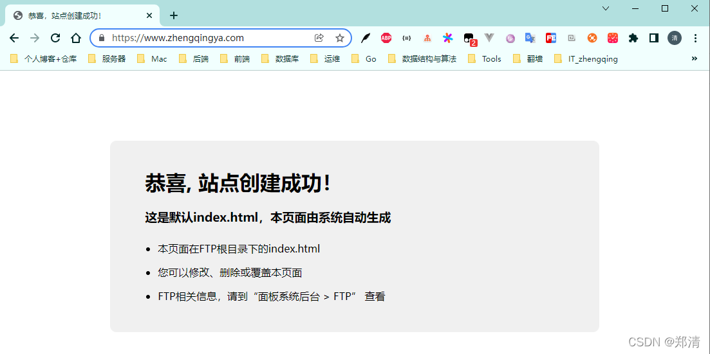
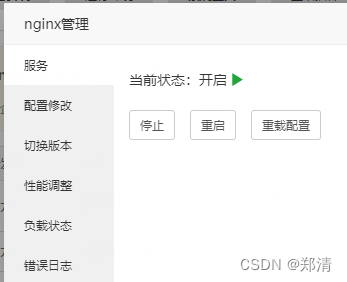
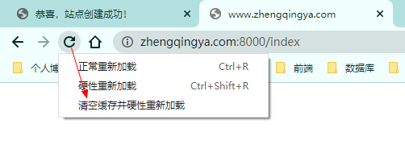

# OHTTPS配置免费证书及宝塔网站管理配置

### 一、前言

本文将通过`OHTTPS`来配置免费的https证书，以及通过`宝塔`来安装`nginx`部署网站并使用https访问网站

> tips: 本文仅是简单记录下操作流程`^_^`

### 二、OHTTPS配置免费证书

> https://ohttps.com

##### 1、创建证书

  
  
这里主要是在`域名解析`中配置下这里获取的`主机记录`和`记录值`

##### 2、域名解析配置

小编举例在阿里云上如下配置即可  

##### 3、验证解析记录

添加记录成功之后，回到OHTTPS中验证解析记录，成功后，可创建证书完成  

##### 4、查看证书

`证书` -> `选择一个证书进行查看` -> `查看证书文件`

> tips: 后面在宝塔中需要使用到这里的`私钥文件`和`证书文件`

### 三、宝塔网站管理配置

##### 1、添加站点

  

##### 2、配置SSL

使用OHTTPS中的`私钥文件`和`证书文件`即可  
  

##### 3、访问网站测试

保存成功之后，访问网站即可 [https://www.zhengqingya.com](https://www.zhengqingya.com/)  

##### 4、其它

如果出现网站访问不了的情况，可尝试重启nginx  

还有一点，小编在配置好之后，通过https访问网站后，由于访问网站地址和宝塔访问地址是同一个域名，导致访问宝塔的时候，谷歌浏览器自动跳转访问https请求的宝塔地址，致使宝塔无法正常访问

解决： `F12` -> `Application` -> `Clear site data` 再`清空缓存并硬性重新加载` http请求的宝塔地址即可  

---

> 今日分享语句：  
> 别小看任何人,越不起眼的人。往往会做些让人想不到的事。

