### 一、前言

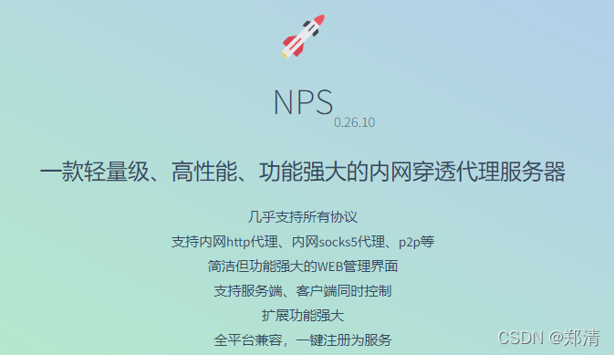
[https://github.com/ehang-io/nps](https://github.com/ehang-io/nps)

### 二、CentOS7.6上启动服务端

```shell
# 下载服务端
wget https://github.com/ehang-io/nps/releases/download/v0.26.10/linux_amd64_server.tar.gz
# 解压
tar -zxvf linux_amd64_server.tar.gz

# 安装
sudo ./nps install

# 修改配置 `nps.conf` -- 这里默认配置也可  【 小编因端口占用问题，修改了 http_proxy_port 和 https_proxy_port 】
vim /etc/nps/conf/nps.conf

# 启动
sudo nps start

# 查看日志
tail -fn 100 /var/log/nps.log
```

访问 `ip:8080`
默认账号密码 `admin/123`

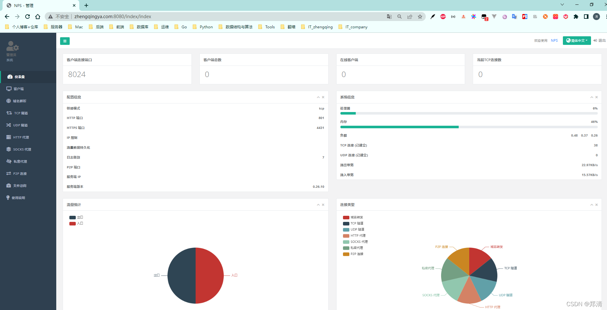

#### 新增客户端

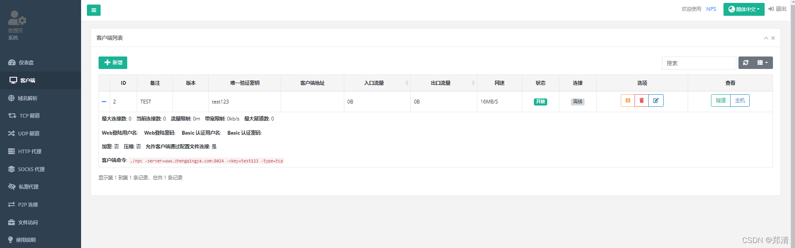

#### 新增TCP隧道

访问 `8100` 端口可代理到本地 `127.0.0.1:20040`
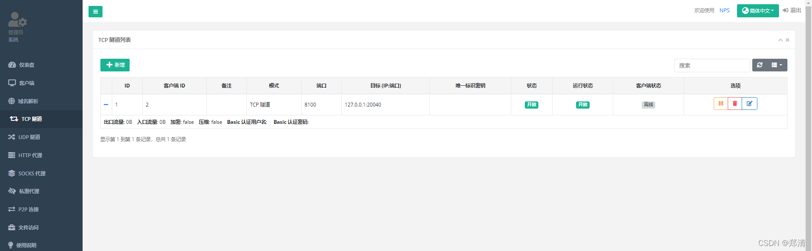

### 三、Windows上启动客户端

>
下载解压 [https://github.com/ehang-io/nps/releases/download/v0.26.10/windows_386_client.tar.gz](https://github.com/ehang-io/nps/releases/download/v0.26.10/windows_386_client.tar.gz)

```shell
npc.exe -server=www.zhengqingya.com:8024 -vkey=test123 -type=tcp
```

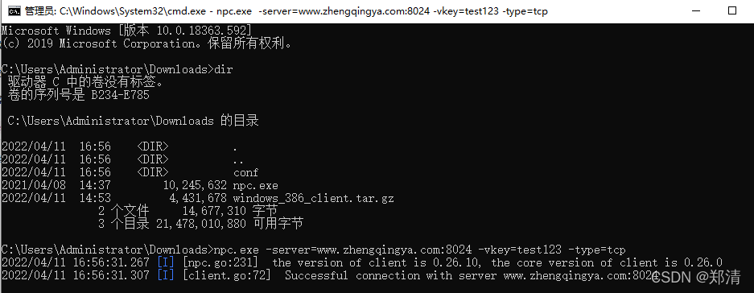
客户端启动成功后，可在服务端中查看是否在线
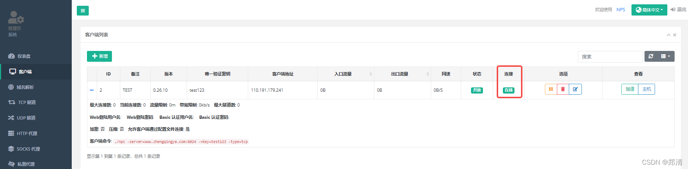

### 四、访问测试

访问 `8100` 端口可代理到本地 `127.0.0.1:20040`
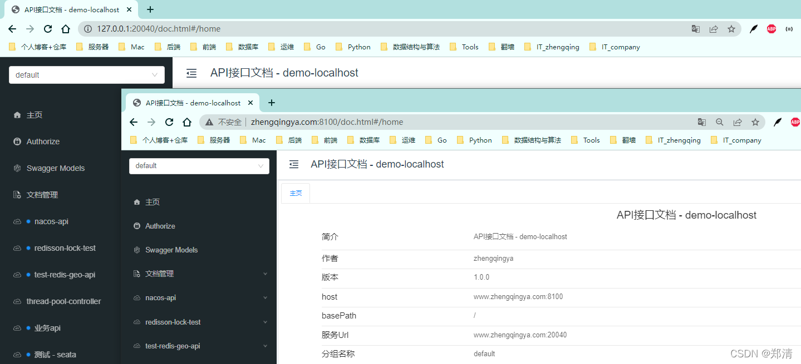

### 五、SSH连接局域网Linux服务器

#### 1、修改 `TCP隧道` -> `目标 (IP:端口)` -> `127.0.0.1:22`

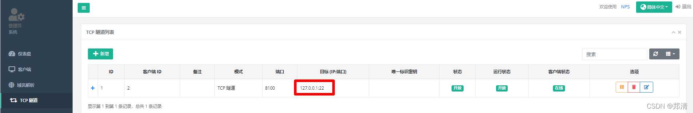

#### 2、局域网Linux服务器启动客户端

```shell
# 下载服务端
wget https://github.com/ehang-io/nps/releases/download/v0.26.10/linux_amd64_client.tar.gz
# 解压
tar -zxvf linux_amd64_client.tar.gz

# 赋予可执行权限
chmod +x npc

# 启动
sudo ./npc -server=www.zhengqingya.com:8024 -vkey=test123 -type=tcp
```

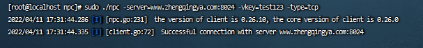

#### 3、SSH 连接

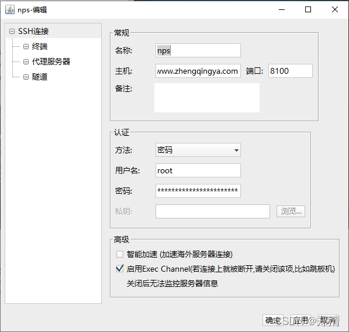
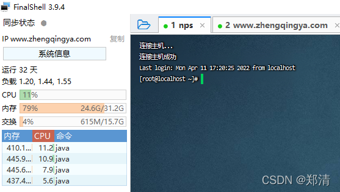

### 六、docker-compose部署NPS

> 可参考 [https://gitee.com/zhengqingya/docker-compose](https://gitee.com/zhengqingya/docker-compose)

```shell
# 准备
git clone https://gitee.com/zhengqingya/docker-compose.git
cd docker-compose/Linux

# 运行服务端 NPS
docker-compose -f docker-compose-nps.yml -p nps up -d

# 运行客户端 NPC
docker run -d --name npc --net=host ffdfgdfg/npc:v0.26.10 -server=服务端ip地址:8024 -vkey=唯一验证密钥 -type=tcp
```

--- 

> 今日分享语句：
> 在改变自己心态的瞬间，人生就出现了转机，此前的恶性循环会被切断，良性循环就开始了。
