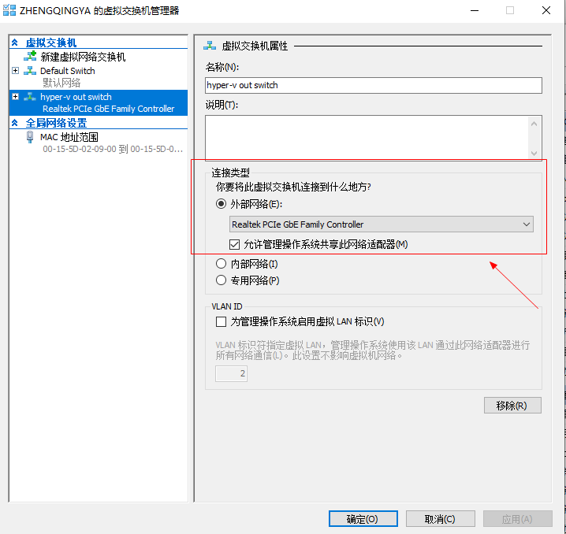
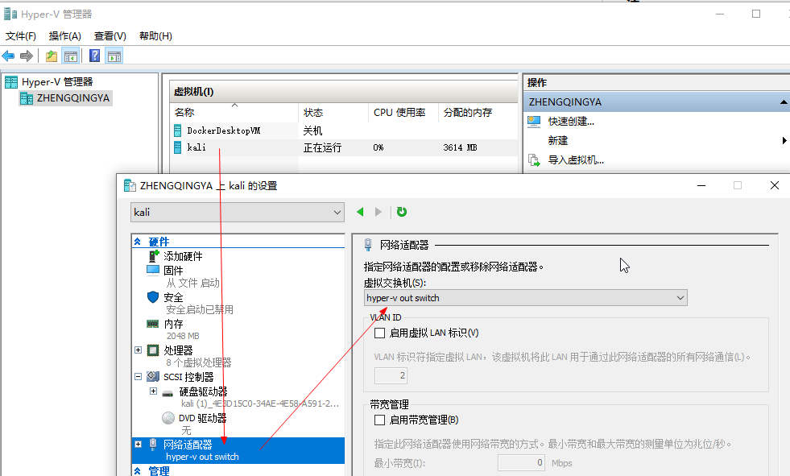
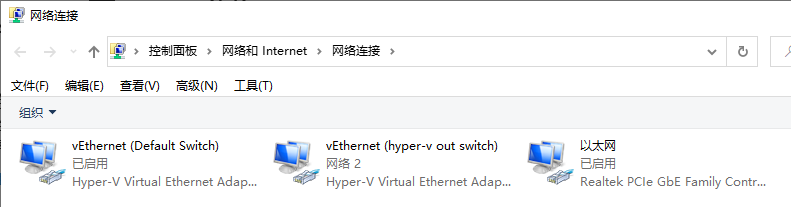

# 虚拟机Hyper-V无法联网问题

### 法一

为虚拟交换机命名 -> 应用

网络连接中查看刚刚新建的虚拟交换机

然后选择现有的网络连接

然后在虚拟机设置中配置上面新建的虚拟机交换机

然后重新启动虚拟机就可以正常联网了

### 法二

新建虚拟交换机 选择 外部网络

虚拟机 -> 设置 -> 网络适配器 选择刚才新建的即可

### 法三

> 参考 https://learn.microsoft.com/zh-cn/virtualization/hyper-v-on-windows/user-guide/setup-nat-network#create-a-nat-virtual-network
