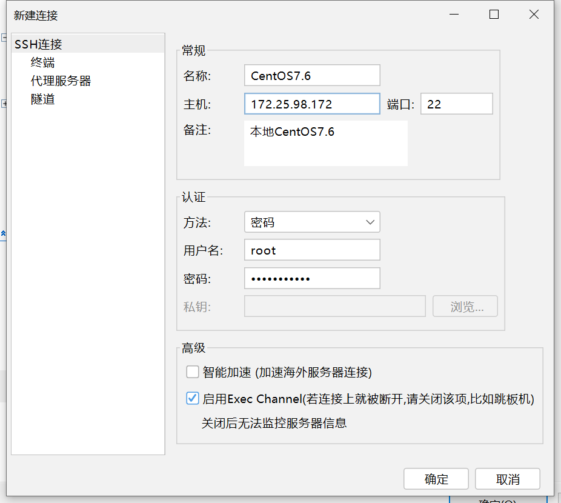
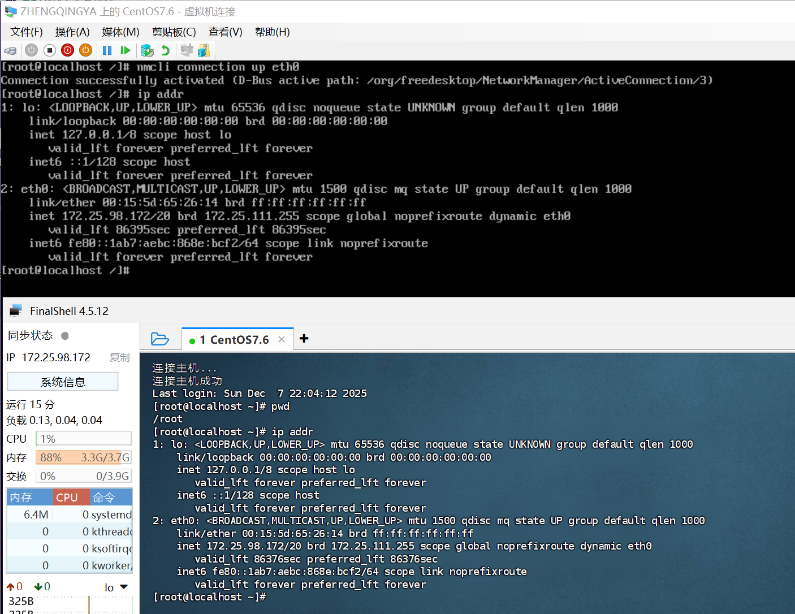

# Hyper-v安装CentOS7.6

### 一、镜像下载

CentOS7.6镜像地址：https://mirrors.aliyun.com/centos-vault/7.6.1810/isos/x86_64/


1. 下载 https://mirrors.aliyun.com/centos-vault/7.6.1810/isos/x86_64/CentOS-7-x86_64-DVD-1810.torrent
2. 双击使用迅雷打开&下载


下载完成之后得到：


### 二、Hyper-v创建虚拟机

#### 法一：快速创建


#### 法二：新建虚拟机 -- 可自定义配置


### 三、启动虚拟机 & 安装

启动连接系统


开始安装


安装位置选择


设置ROOT密码


完成配置


重启进入系统


### 四、FinalShell 连接

```shell
# 默认eth0接口没有分配到IP地址，直接激活连接 -- 作用：使网卡eth0建立网络连接并获取IP地址。
nmcli connection up eth0
# 查看ip地址信息
ip addr
```



